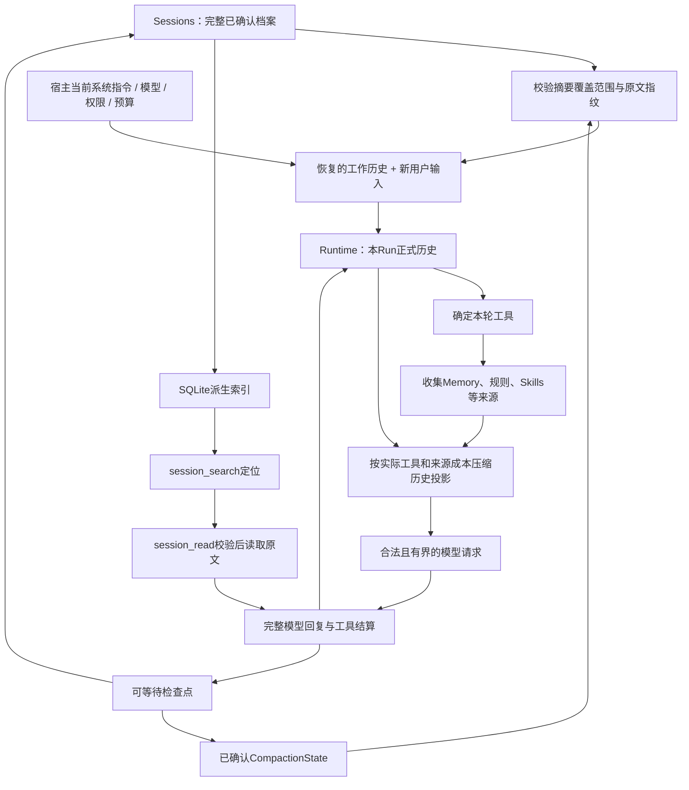

# 上下文与三类记忆

[文档首页](../README.zh-CN.md) · [核心执行](RUNTIME.zh-CN.md) · [扩展接入](EXTENSIONS.zh-CN.md)

本文解释当前 Run、持久会话、压缩、精选长期记忆与历史检索怎样配合。这里的“三类记忆”是信息用途的划分，不是“核心层、扩展层、产品层”之外的三层软件架构。

## 1. 三类记忆及其所有者

| 类型 | 内容与用途 | 谁维护 | 怎样被模型使用 |
|---|---|---|---|
| 当前工作记忆 | 当前问题、已接纳回复、工具结果和宿主恢复的工作摘要，用来继续当前任务 | Runtime 管一个 Run；宿主或 Sessions 连接多个 Run | 随本轮请求直接提供，必要时先压缩投影 |
| 精选长期记忆 | 跨会话仍值得反复使用的偏好、稳定事实与约定 | 独立 `memory` 后端 | 少量 Markdown 事实按授权范围稳定注入 |
| 历史会话记忆 | 过去具体说过什么、执行过什么，包含当前会话被压缩的早期原文 | `sessions` 保存事实，`sessions/search` 定位和读取 | 模型按需调用搜索/读取工具，不自动加载全部历史 |

例如，用户先说“使用公网部署”，随后纠正为“仅在内网部署”：Memory 可以替换过时事实；Sessions 应保留纠正发生的过程。二者虽然都帮助记忆，但修改语义不同，因此保留两个独立包。

Memory 不负责保存整段聊天，Sessions 不自动判断什么值得成为长期事实。自进化、后台复盘、自动技能提炼不属于两者的当前实现；普通 Agent 通过获授权的记忆工具更新一条事实，不等于存在自进化任务。

## 2. 必须区分的五份数据

| 对象 | 内容 | 不能拿它替代什么 |
|---|---|---|
| 完整会话档案 | 已确认用户消息、助手回复、工具调用/结果、轮次与工作集状态 | 不应每轮全量塞入模型，也不能被摘要覆盖 |
| 当前 Run Transcript | 启动时接纳的工作历史，加本 Run 新产生的正式记录 | 不一定等于从会话创建以来的全部原文 |
| 本轮 Projection | Transcript 的副本经过变换，再加本轮上下文来源 | 不能直接覆盖会话档案或当作新用户输入 |
| `CompactionState` | 结构化摘要、覆盖的整组消息范围和原文指纹 | 不是原文，也不证明摘要语义一定正确 |
| UI 快照/回放 | 面向展示的有界工作项和短期事件 | 不是恢复、检索或审计的完整事实源 |

当前 Run 的消息放在内存中；运行结束后随 `RunReport.transcript` 交给可信宿主。持久化通过可选检查点和 Sessions 实现，内存工作集与磁盘档案并存，不是二选一。

一个长会话开始新的 Run 时，可以只恢复“有效摘要 + 尚需保留的完整消息”。因此原会话档案可能比 Core 接纳的工作集大；这不是取消 Core 的容量保护。

## 3. 从会话到模型的完整数据流

图中索引不是第二个会话正本。搜索结果经过普通工具路径进入当前 Run，和其他工具一样受权限、输出预算与取消控制。搜索不会执行旧历史中的命令，也不会替用户恢复旧系统权限。

## 4. 每轮上下文构造的顺序

| 顺序 | 动作 | 二次开发约束 |
|---|---|---|
| 1 | 从已结算的正式历史运行 `ToolSelector` | 同轮只选择一次；只能收紧工具上限 |
| 2 | 调用全部 `ContextTransform::sources` | 返回具名的 `ContextBlock`，不要修改正式执行事实 |
| 3 | 计算实际工具声明和全部来源开销 | 不能压缩完成后再无预算追加一大段规则或记忆 |
| 4 | 按顺序执行 `transform`，构造历史投影 | 每次返回都校验消息与工具配对；摘要算法属于扩展 |
| 5 | 在开头 System 消息之后插入来源 | 来源不是最后一条真实用户请求，也不能插进调用/结果之间 |
| 6 | 验证最终请求并发给模型 | 超限明确失败；恢复时复用同轮工具和来源 |

`ContextBlock` 在当前 Model 请求中编码为带来源说明的 User 消息，但它的语义是宿主提供的参考数据，不是用户新发了一条指令。它不进入正式 Transcript，也不授予任何工具权限。该包装不是防提示注入的安全沙箱；不可信来源仍应由宿主控制范围和内容。

如果一个来源指导模型通过某个工具读取正文，它必须检查该工具是否在本轮集合中。当前 Skills 在未提供或排除了 `read` 时，不发布不可用的技能目录。

## 5. 压缩、窗口计量与有限恢复

Core 提供字节保护与调用时序；`compaction` 决定何时压缩、压缩哪些整组消息和生成什么摘要。

已知实际模型窗口时，压缩组件结合输入估算与预留输出空间判断压力，同时继续受请求字节硬限制约束。窗口未知时使用字节预算；不能根据模型品牌猜测窗口，也不能借用切换前模型的配置。

模型网关只为成功的主对话请求记录输入用量锚点。只有模型选项、工具声明和历史前缀匹配才复用该锚点，新增尾部仍为估算。摘要等辅助调用照常计入预算和用量，但不污染主对话占用估算。

### 哪些内容可以压缩

较早的已结算消息按完整组处理，工具调用及其结果不可拆开。当前实现保护系统消息、最新用户请求、必要近期组、媒体/未解析资源以及包含私有回传数据的完整组。可压缩旧工具观察，但不能把签名和推理私有字段改写为摘要后假称可继续原协议。

摘要使用 `TaskSummary`，字段包括目标、约束、纠正、决定、已完成动作、待办和重要引用。后续压缩合并旧交接记录与新事实；计划、工具 intent、失败或未知结果不能被直接当成完成。

摘要缺字段、截断、超预算或未实际缩小请求时明确失败，不裁切结构化摘要，不自动另开一个模型修复流程。格式与覆盖校验不保证模型永不遗漏事实，真实部署仍应评估连续压缩后的信息保留质量。

### 压缩状态如何保存

Compactor 缓存以 Run 隔离，`state(run_id)` 导出独立状态；Sessions 在可等待的提交过程中捕获并同会话文件一起保存。必须在 `finish` 清除运行缓存前捕获，不能等到所有清理完成才第一次索取状态。

恢复时核对原文指纹、覆盖范围和工具组边界，再生成较小工作集。正式档案保持原文。用户在正文中伪造一个“摘要标记”，不会被当成可用的持久压缩状态。

供应商确认上下文超限后，Runtime 最多触发一次 `recover_context`；只有严格变小才重发。当前受保护内容太大、无法压缩或重发后仍溢出时，明确停止，而不是无限循环。

## 6. 持久会话的接纳与恢复

Sessions 的普通入口由宿主提供状态目录、工作目录与权限域。当前会话文件保存完整事实、最新确认检查点和工作集状态，采用原子完整文件替换，不是增量事件 WAL。

正确装配必须使用同一 Store、`SessionSink` 和 `sessions::runtime`。需要压缩时，执行器装配的 Compactor 与 `Store::attach_compactor` 指向同一实例。使用 Application 的宿主可通过 `application/sessions` 的 `SessionApplication` 复用接纳流程。

新轮次在同一接纳边界校验 revision、请求身份、历史大小和模型兼容性，再可靠保存输入。重复的已保存请求返回原轮次，不再次运行；相同请求 ID 却更改内容会冲突。当前系统指令、模型、权限和预算由宿主重新提供，不从会话档案还原旧授权。

崩溃后恢复已确认记录，运行中轮次标记为中断。没有 intent 的未派发调用可标为 Skipped；已确认 intent 但无结果时为 Unknown；已有确认结果保持原状态。恢复不会自动调用模型或重跑工具。尚未完成的流式片段不是已确认助手回复。

## 7. Memory：精选事实，不是另一个会话库

Memory 普通接口为 `Backend::read` 与 `apply`，宿主通过 `Binding` 指定空间名、后端和是否可写。插件只将这些能力接入既有来源和工具接口，生产依赖不包含 Sessions 或具体 Runtime。

当前正式后端使用单个 `MEMORY.md` 作为正本。正文是独立 Markdown 条目，受限注释元数据保存条目身份、时间与写入来源；它不是任意 Markdown 文件的无约束导入器。修改必须携带当前内容指纹 revision，批量操作按最终结果原子校验；超限或冲突不静默覆盖、裁剪或淘汰旧条目。

注入按空间和条目顺序稳定输出全部小容量精选正文，不执行关键词召回，也不把无关的最近条目凑进上下文。修改/删除在后续请求构造时刷新；同轮恢复仍使用该轮已收集的来源。已发给模型或已进入旧会话的内容，不会因删除 Memory 条目而被撤回。

`memory_read` 提供条目与当前 revision；`memory_update` 既要求 Binding 可写，也要求宿主最终授权。来源记录来自实际运行/调用身份，不相信模型自报身份。格式校验不等于事实核验，也不能识别全部敏感信息。

个人与工作区两个空间是当前 Web 的装配策略，不是 Core 强制划分。其他宿主可以绑定自己的具名空间，但不能让模型参数自由选择用户目录或权限域。

## 8. Sessions 历史检索：索引可重建，原文才是证据

`sessions/search` 使用 SQLite FTS5 派生索引。查询时按会话版本/文件状态增量刷新，结果定位到 session、turn、消息位置和内容指纹，再从会话正本读取。索引失败不会回滚已保存的任务；损坏或刷新失败也不能伪装成零结果。

搜索使用少量中文/英文关键词或标识符，表达式由实现安全构造，不接受调用方直接拼 SQL 或任意 FTS 语法。它是全文关键词检索，不是向量或语义检索；没有相关原文就返回空，不再调用模型生成一份“回忆”。

索引和原文工具只处理已确认的用户文本、助手可见文本、工具文本与状态，不返回 System、隐藏推理、ProviderData 或媒体载荷。普通文本本身仍可能敏感，字段过滤不替代访问控制。

`ScopeResolver` 由可信宿主提供；模型只能进一步指定某个会话来缩小范围。`session_read` 再次核对范围和内容指纹。只追加历史不使未变的原文定位失效；内容变化则重新检索。分页按完整 UTF-8 边界返回，并可获取相邻消息定位。

索引工作不应长期占有可靠会话提交锁。当前实现只在捕获源快照时短暂持有 Store 锁，SQLite 查询与分词另行受期限和取消控制，返回前核对来源版本；变化时明确重试，不返回混合代的数据。

## 9. 模型切换与其他上下文来源

普通历史按目标 Model 适配器转换消息格式；私有回传历史需要匹配协议、实际模型路由和相关私有配置。预检发生在任何摘要调用之前，实际启动时针对绑定模型再检查。不能通过先压缩掉不兼容字段绕过检查。

`instructions` 提供规则来源与写前变更检查；`skills` 提供可读的技能目录；`spill` 归档大结果并通过受授权的引用读取。它们均不属于 Memory 的存储职责。Spill 引用的可访问性还依赖归属和保留期限，不能因为摘要保留了 URI 就保证文件永久存在。

## 10. 不装配某项能力时

| 装配 | 仍然具备 | 明确缺少 |
|---|---|---|
| 只有 Runtime | 当前 Run 的上下文、模型/工具闭环；宿主传回历史即可接续多轮 | 默认持久会话和精选长期记忆 |
| Runtime + Sessions | 保存、重启查看、显式续聊 | 没装 Memory 就不注入长期事实；没启用 search 就不提供历史全文工具 |
| Runtime + Memory | 跨 Run 使用绑定的长期事实 | 无法凭 Memory 恢复完整旧对话 |
| 未装 Compaction | 仍有历史与请求硬限制 | 超出请求容量时拒绝，不会自动缩短上下文 |
| 完整装配 | 会话、压缩、长期事实与原文检索配合 | 仍不等于无限长会话、自动自进化或精确事实保证 |

## 源码定位

| 关注点 | 源码 |
|---|---|
| 来源、投影与计量 | [`api/context.rs`](../../packages/api/src/context.rs)、[`runtime/engine.rs`](../../packages/runtime/src/engine.rs)、[`runtime/meter.rs`](../../packages/runtime/src/meter.rs) |
| 压缩及结构化交接 | [`compaction/src/lib.rs`](../../packages/compaction/src/lib.rs)、[`summary.rs`](../../packages/compaction/src/summary.rs)、[`state.rs`](../../packages/compaction/src/state.rs) |
| 会话事实与恢复 | [`sessions/src/store.rs`](../../packages/sessions/src/store.rs)、[`context.rs`](../../packages/sessions/src/context.rs)、[`lifecycle.rs`](../../packages/sessions/src/lifecycle.rs) |
| Markdown 记忆与注入 | [`memory/src/store.rs`](../../packages/memory/src/store.rs)、[`plugin.rs`](../../packages/memory/src/plugin.rs) |
| 全文检索与原文读取 | [`sessions/src/search.rs`](../../packages/sessions/src/search.rs) |
| 规则、Skills 与归档 | [`instructions/src`](../../packages/instructions/src)、[`skills/src`](../../packages/skills/src)、[`spill/src`](../../packages/spill/src) |
