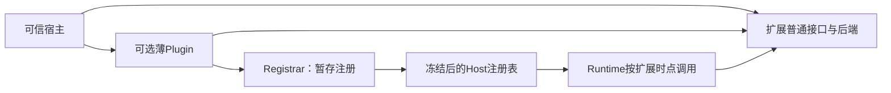

# 扩展接口与装配机制

[文档首页](../README.zh-CN.md) · [总体架构](OVERVIEW.zh-CN.md) · [核心执行](RUNTIME.zh-CN.md)

本文面向为 Mona 增加模型、工具、上下文、存储或业务编排能力的开发者。选择最窄的现有接口，先提供普通可复用能力，需要注册或生命周期管理时再提供薄 Plugin；不要求所有能力先实现 Plugin。

## 1. 应该使用哪个接口

| 开发需求 | 接口/位置 | Runtime 会保证什么 | 实现方仍须负责什么 |
|---|---|---|---|
| 新模型协议 | `api::Model`，通常位于 `providers` | 统一请求预算、取消、输出收集、重试与审计 | 协议映射、流终态、错误事实、私有历史和具体传输限额 |
| 业务动作 | `api::Tool` | 参数校验、工具集合检查、授权、调度、结果结算 | 副作用真实性、外部资源权限、幂等和中断后核查 |
| 规则、目录或长期事实注入 | `ContextTransform::sources` | 同轮收集、来源开销计量、统一插入 | 来源范围、有界读取、工具可用性、不把参考当新指令 |
| 改变模型可见历史 | `ContextTransform::transform` / `recover_context` | 变换时限、配对校验、请求硬限制和有限恢复 | 摘要或检索算法、事实保留与完整组处理 |
| 归档或整理工具输出 | `ResultTransform` | 在结果最终限额前调用，检查身份和状态未被篡改 | 保存成功后再发布引用、读取能力、配额与收尾 |
| 动态否决一次工具调用 | `ToolPolicy` | intent 确认后、实际派发前调用 | 根据当前状态作决定，响应取消；不能放宽宿主权限 |
| 按任务缩小工具集合 | `ToolSelector` | 每轮一次，只能收紧，之后计量/发送/派发保持同一集合 | 使用已结算正式历史，不依赖尚未生成的来源或摘要 |
| 可靠保存运行快照 | `CheckpointSink` | 等待确认、失败停止、同 Run 有序提交 | 后端持久性、重复提交、授权和确认未知时的查询 |
| 非关键进度观测 | `EventObserver` | 有界事件订阅与宿主关闭时的回收 | 接受事件丢失，不用它承担唯一的业务提交 |
| 上层计划/任务组合 | `AgentExecutor` / `AgentRuntime` | 每个子 Run 继续使用相同执行语义 | 父子关系、共享 Task、汇总结果和上层业务策略 |

不要为了“通用扩展”新增一个可以任意改 Runtime 状态的万能 Hook。现有接口无法表达的需求，应先确认它真的是所有宿主共用的执行职责，而不是某个扩展自己的策略。

## 2. 普通接口与薄 Plugin

普通接口承载真实能力。例如 Memory `Backend` 提供读取/修改，Sessions `Store` 提供保存/恢复，规则对象实现来源与策略。它们不需要依赖具体 Runtime 实现或 HTTP 路由。

Plugin 只做装配：注册工具、来源、策略或服务，并在需要时关闭自己拥有的资源。不要在 Plugin 和普通接口各保留一套行为不同的实现。

直接装配可使用 `HostBuilder.model/tool/context_transform/result_transform/policy/tool_selector/checkpoint_sink/observer`。多个接口必须共享状态时，使用同一扩展对象，例如同一个规则对象的来源和写前策略、同一个 Compactor 的投影和持久状态导出。

## 3. Plugin 安装和关闭

当前 Plugin 是随宿主编译的可信 Rust 组件，不是动态库 ABI、下载市场或跨语言插件协议。

`PluginManifest` 的 id 和 api_version 标识当前契约，requires/provides 是类型服务注册表的键，不是工具名称、包路径或配置文件。组件发布了服务时，实际新增的服务必须与 provides 一致。

安装过程先检查重复 ID、版本、缺失服务和依赖环，再按可满足依赖的顺序安装；同样就绪的插件保持输入顺序。每次安装先写暂存 Registry，成功后才发布；失败会关闭部分初始化的插件，并逆序关闭已安装插件。

注册表在 Host 运行期间冻结。更改工具实现、注册集合或 Plugin 配置应由宿主重新装配，而不是在活动 Run 中替换注册表。模型管理在同一注册的路由能力内为新 Run 选择配置，不等于热加载整个 Host。

| 生命周期 | 应做的事 | 不应做的事 |
|---|---|---|
| `install` | 校验配置、构造有界资源、注册公共能力 | 靠模型调用才能完成基本注册；留下无法追踪的后台任务 |
| 每 Run 的上下文/工具调用 | 响应运行取消和限额，只操作授权范围 | 把当前用户或运行数据放进无范围的全局变量 |
| `ContextTransform::finish` / `ResultTransform::finish` | 工具停止后释放本 Run 缓存、租约等 | 再发起任务、依赖已取消令牌阻止所有清理 |
| `Plugin::shutdown` | Host 排空后关闭插件资源 | 在活动工具仍使用资源时提前释放连接或存储 |

直接使用变换器而不经过 Runtime 的宿主，也必须自行调用其收尾方法。单纯 drop 不能替代可等待的资源关闭。

## 4. 实现 Model 时必须满足的契约

Model 是原始适配器，接收 `ModelRequest`，输出 `ModelEvent` 流；应用扩展需要辅助推理时应使用 `RunContext.model`，不直接绕过网关调用适配器或 HTTP。

| 事件/方法 | 必须遵守的语义 |
|---|---|
| `Text` | 新增可见文本，不重复发送累计全文 |
| `ToolDelta` | 按稳定 index 逐步形成 ID、名称和参数；参数是新增片段，完成前不可执行 |
| `Reasoning` | 私有协议内容，不自动成为可展示的推理事件 |
| `ProviderData` | 带命名空间的完整不透明快照，不是 JSON patch；保存顺序与对应身份 |
| `Usage` | 当前请求的累计用量快照；`input_tokens` 含缓存流量，缓存读写是可选分项，不是逐次相加的 token 增量 |
| `Finish` + `End` | 区分模型结束原因与协议完成；TCP EOF 本身不能冒充成功 |
| `validate_history` | 纯、有限的本地检查，不联网、不改写历史、不用它测试密钥 |
| `context_window_tokens` | 只返回实际选择模型的已知窗口；未知返回 None |

适配器分类鉴权、额度、限流、服务端、上下文超限、传输和协议错误，可附 HTTP 状态、等待时间及已输出事实；不自行实现额外重试循环。错误处理不能把密钥或供应商原始正文直接交给 UI。

已有 Providers 支持 Chat Completions、Responses、Messages；协议被支持不代表具体模型支持所有模态或参数。模型能力“未知”不能被写成“支持”。凭据、端点、模型目录与配置持久化属于宿主/Models，不通过任意工具参数授权。

更换协议时，普通历史可以做格式映射；私有签名、加密内容和推理信封必须通过对应适配器的来源/内容检查。不支持时明确拒绝，不能静默丢字段、改写工具 ID 或使用别的模型接续。

## 5. 实现 Tool 时必须满足的契约

`ToolSpec` 描述名称、用途、object 根 JSON Schema、并发方式和 side_effects。注册时编译 Schema；工具描述不应做网络发现。参数验证由 Runtime 统一完成，工具内部仍要验证外部资源的当前状态与访问权限。

工具返回 `ToolOutput`：content、可选 structured、artifact 和 is_error。已知业务失败可返回 `ToolOutput::error`，使模型获得可操作的错误；执行异常使用错误返回。Denied、Skipped 和 Unknown 由执行器决定，不能由工具伪造。

content 是模型观察，不是自动安全的 UI 内容；structured 也不是任意前端可执行对象。`ArtifactRef` 是定位，不证明正文已保存，更不授予读取权限。保存完成后才发布引用，并为宿主提供可用的受控读取路径。

`ToolProgress::report` 和 `set_detail` 只更新有界展示；最终事实必须在返回值中。不能因为进度丢失、UI 裁剪或浏览器断开就改变执行结果。

`Exclusive` 只约束同一 Run 的工具调度。跨 Run 共用文件、账号或外部业务对象时，扩展需要自己的锁、事务或幂等机制。原生插件可以直接访问进程权限范围内资源，side_effects 标志不是安全隔离。

## 6. 组合扩展时的关键约束

| 组合 | 正确做法 | 常见错误 |
|---|---|---|
| Skills + 动态工具选择 | 来源检查本轮实际是否提供读取工具 | 发布无法读取的路径目录，让模型反复请求不存在的工具 |
| Memory/规则 + 压缩 | 先收集全部来源并预留成本，再压缩正式历史 | 把来源当最新用户请求，或压缩后无预算追加 |
| Compactor + Sessions | 同一 Compactor 导出状态，与对应 Store/Sink 一起确认 | 保存来自另一 Run 的摘要，或缓存清理后才尝试导出 |
| Shell + Spill | 输出流与结果归档共用已装配后端，引用读取受宿主校验 | 创建两套读取规则不同的结果库；URI 存在就认为可以跨会话读取 |
| Memory + 历史检索 | 独立作用域，普通工具和来源接口组合 | 强制把 Memory 与会话数据库捆绑；把搜索结果自动写成长期事实 |
| Planner + Sessions/压缩 | 从已确认检查点恢复精确计划，以可信 seed 绑定新 Run；当前计划作为来源参与预算 | 从摘要或 UI 勾选恢复状态；把未确认的实时快照当已保存结果 |
| 多个模型调用/子 Run | 复用 `RunContext.model` 或共享 `TaskControl` 的执行入口 | 每次构造新 Task 重置调用预算与总期限 |
| 多个持久化目的地 | 外部协调后通过一个 Sink 声明成功条件 | 注册多个相互独立的 Sink，假定它们自动形成跨库事务 |

`requires/provides` 解决服务依赖，不应被误当成任意运行回调优先级系统。来源在全部变换前集中收集，transform 按注册顺序执行；需要特定顺序时由组合根明确装配。

### 同一 Agent 的计划管理

`planner` 组合普通工具、上下文来源、工具选择器和派发策略，不包装执行器，不调用模型，不为每个步骤创建 Run。普通模式按需建立清单并推进；显式计划模式只提供获准的只读调研工具和计划工具。`plan_submit` 保存完整方案但不授予执行权；提交后同批其他调用仍经策略检查，不能借尚未刷新的工具列表继续操作。

计划工具的结构化结果保存整份有界状态，并通过原有检查点确认。`live_snapshot` 只是暂态；恢复使用 `recover_checkpoint` 或完整已确认工具历史。宿主在新的用户轮次调用 `bind_state`，模式与精确计划不依赖摘要是否记住它们。已完成步骤不能被普通更新改写；修改剩余步骤必须说明原因，进度声明不替代业务验收。

规划模式、审批与沙箱分别装配。标准 Web 已通过配套模块接入计划菜单与面板，未加入通用审批服务；宿主从最新持久版本出发处理确认、继续和修改，不允许模型自行切换。完整接口、正常/计划模式装配和限制见 [Planner](../../packages/planner/README.md)。

### 子任务委派

`subagent` 的 Service 管理父子身份、异步启动、消息、等待、停止与有界记录；Driver 由宿主提供现有 `AgentRuntime`、绑定模型和可信环境，薄 Binding/Plugin 只接入工具与生命周期。它不实现第二套 ReAct，也不依赖具体 Runtime、模型供应商或 Web。可直接移植的 Codex 并发许可代码保留固定提交、原许可证与修改说明，未引入整个 `codex-core`。

子任务通过 `TaskControl::branch` 共享总模型额度和期限、独立取消，使用自己的 Session/Turn 保存确认记录。工具集合始终与父任务当前实际集合相交；角色配置不能扩大授权，父计划与沙箱不能借委派绕过。fork 取模型调用前的已配对工作快照，independent 不继承父对话；两者仍受原历史兼容性、容量、模型预算和取消检查。

消息投递只保存信息，不启动空闲子任务；后续任务在同一子会话建立明确的新轮次。等待超时不取消子任务，终态必须等待原有可靠保存。父任务结束时排空所属后代，重启只恢复记录，不重跑未知副作用。完整接入、默认角色与容量见 [Subagent](../../packages/subagent/README.md)。

### MCP 外部工具和资源

`mcp::Service` 持有官方 SDK 客户端，stdio 与 Streamable HTTP 复用其协议实现，返回普通 Tool 和薄 Plugin，不引入第二套执行器。外部工具使用稳定命名空间，参数仍在 Runtime 的统一校验处验证；MCP 显式补上协议默认 JSON Schema 2020-12，普通未声明工具保持 Draft 7。

远端工具默认有副作用，只有宿主确认的白名单才标记只读，不能从服务器注解直接取得权限。instructions 和资源是有来源的参考资料，不作为系统权限或本机路径。配置与目录随 Host 装配固定；目录改变停用旧定义并要求重新装配，显式重连不自动重放调用。取消不代表远程回滚，宿主须在任务排空后关闭共享连接。接口、协议范围和限额见 [MCP](../../packages/mcp/README.md)。

## 7. 包装 AgentRuntime 的要求

会话收尾和模型绑定等装饰器应保持公共接口的语义，不应再执行自己的 ReAct。

包装器转发纯 `validate_history`，实际 start 针对绑定模型再检查。`execute` 使用 `RunHandle::wait_owned()` 保留拥有者取消语义；普通 `start`/`wait` 观察者断开不取消任务。运行配置和资源租约要活到已有任务真正结束，不能随一次 HTTP 请求或页面视图销毁。

需要持久会话时，使用可信会话身份；需要临时旁支时，不要伪装为父会话的同一个写入轮次。历史读取权、会话写入身份和工作目录是三个不同概念。

## 8. 扩展完成前应验证什么

验证公共语义，而不是只让成功案例返回一句话。至少覆盖：非法参数不进入工具，权限拒绝，取消/超时后的状态与清理，容量边界，存储失败不虚报成功，跨 Run/作用域不串数据，部分模型输出不自动重试，以及关闭该扩展后基础 Runtime 仍可执行。

模型适配还需要验证事件分块、协议结束、用量、连续工具轮次和私有历史恢复；本地协议夹具不能替代真实目标模型对参数、签名或媒体的接纳验证。

## 源码定位

| 关注点 | 源码 |
|---|---|
| 公共扩展接口 | [`api/model.rs`](../../packages/api/src/model.rs)、[`tool.rs`](../../packages/api/src/tool.rs)、[`context.rs`](../../packages/api/src/context.rs)、[`plugin.rs`](../../packages/api/src/plugin.rs) |
| 注册与生命周期 | [`runtime/host.rs`](../../packages/runtime/src/host.rs) |
| 模型与工具执行边界 | [`runtime/model.rs`](../../packages/runtime/src/model.rs)、[`tools.rs`](../../packages/runtime/src/tools.rs) |
| 普通接口与 Plugin 组合 | [`memory/src`](../../packages/memory/src)、[`instructions/src`](../../packages/instructions/src) |
| 会话/模型包装 | [`sessions/lifecycle.rs`](../../packages/sessions/src/lifecycle.rs)、[`models/lib.rs`](../../packages/models/src/lib.rs) |
| 计划状态、接入与恢复 | [`planner/state.rs`](../../packages/planner/src/state.rs)、[`plugin.rs`](../../packages/planner/src/plugin.rs)、[`history.rs`](../../packages/planner/src/history.rs) |
| 可运行的接口组合 | [`generic_extensions.rs`](../../examples/demo/src/bin/generic_extensions.rs)、[`memory.rs`](../../examples/demo/src/bin/memory.rs) |
