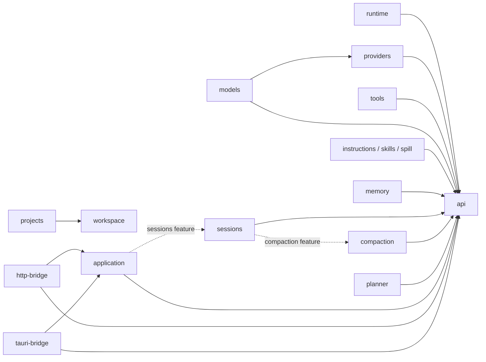
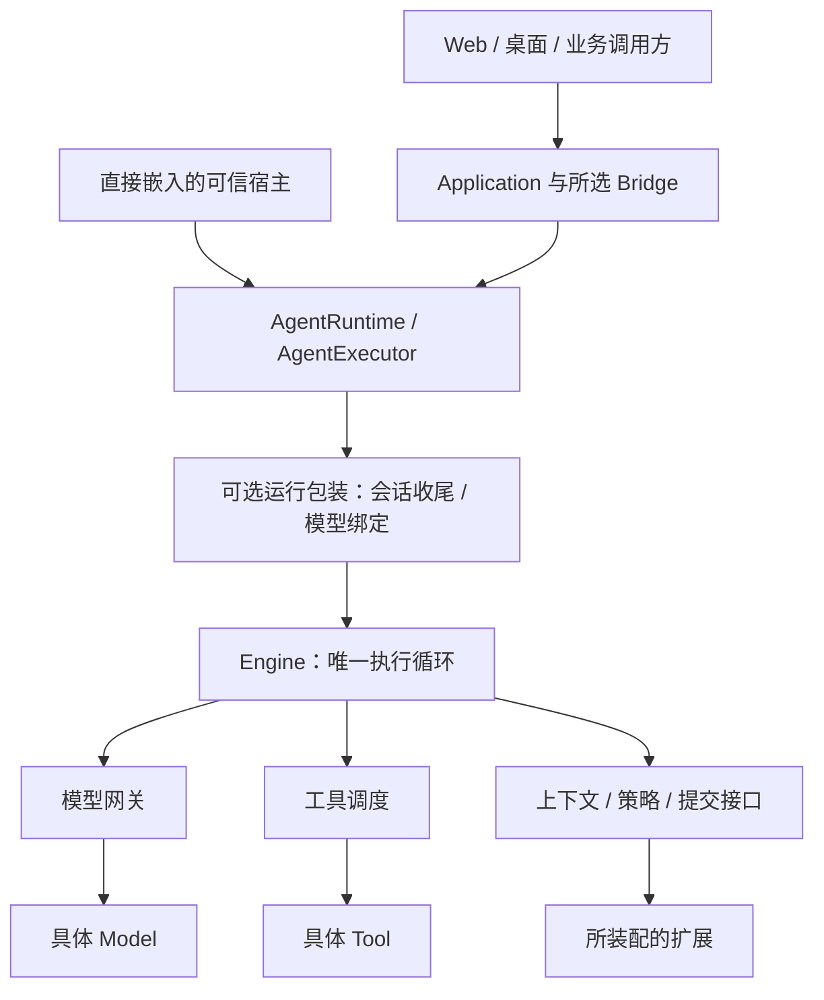

# 总体架构

[文档首页](../README.zh-CN.md) · [核心执行](RUNTIME.zh-CN.md) · [扩展接入](EXTENSIONS.zh-CN.md)

## 1. 项目定位

Mona 是可嵌入的 Agent 执行底座、可组合的扩展能力和一个 Web 产品。它不是要求所有业务都经过 HTTP 的单体服务，也不把编程、运维或办公定义成额外的架构层。

**最小化的是核心职责，不是可靠性。** 当前运行历史、完整模型响应校验、工具调度、预算、取消和可靠提交时点留在核心；具体模型协议、工具实现、压缩算法、文件存储与界面由外部装配。

## 2. 三层职责

| 层 | 组成 | 负责 | 不负责 |
|---|---|---|---|
| 核心层 | `api`、`runtime` | 公共执行契约、唯一默认 ReAct 循环、当前 Run 状态、统一模型网关、工具调度、必要扩展时点 | 供应商配置文件、SQLite、长期记忆文件、工作区登记、Web 页面 |
| 扩展层 | 模型、工具、上下文、持久化与编排组件 | 通过普通接口或薄 Plugin 提供可独立复用的具体能力 | 复制底层执行循环；把宿主账号或页面逻辑写进通用组件 |
| 产品层（Web） | `application`、Bridge、Client、`apps/server`、`apps/web` | 任务调用管理、传输、配置、授权、资源装配和交互 | 另做一套模型重试、工具执行或会话存储实现 |

`api` 是契约，不执行任务；`runtime` 是默认实现。扩展可依赖其他有明确职责的扩展，例如 `models` 使用 `providers`，但不应反向依赖 Web 才能使用。

### 扩展按职责组合

| 职责 | 包 | 边界 |
|---|---|---|
| 模型接入 | `providers`、`models` | 前者适配协议，后者管理供应商配置、模型目录与单 Run 路由绑定 |
| 外部操作 | `tools` | 实现文件、命令等工具；工具集合由宿主选择，不定义所有 Agent 的必选操作 |
| 上下文治理 | `compaction`、`instructions`、`skills` | 分别处理工作摘要、规则来源、技能目录；不拥有完整会话数据库 |
| 长期信息 | `sessions`、`memory` | 前者保存会话事实并提供可选历史检索；后者保存少量可维护的长期事实 |
| 大结果 | `spill` | 保存和取回有期限的大段文本；不是永久附件库 |
| 工作目录与组织 | `workspace`、`projects` | 前者提供目录规范化和受根约束的只读访问；后者提供可选项目登记 |
| 上层任务编排 | `planner` | 生成有限计划、顺序调用已有执行器，共享任务预算；不是第二套 ReAct |

## 3. 生产依赖与执行调用分开看

### 生产依赖图

箭头表示“左侧包在生产代码中依赖右侧包”；虚线表示 Cargo 可选依赖。本图只列项目内部的主要 Rust 依赖，不列第三方基础库、测试依赖和 JS 传输关系。

`runtime` 的测试使用 Memory 和 Planner，不构成生产依赖。`sessions/search` 可选地引入 SQLite；不启用该 feature 时，会话保存恢复不需要 SQLite。Memory 与 Sessions 没有互相依赖。

Server 是组合根，可以同时依赖具体执行器与所选扩展。这样的依赖不应从 Server 反向传播到内层包。

### 执行调用图

下面表示运行时调用，不是编译依赖。Application 使用公共 `AgentRuntime` 接口，宿主决定注入哪个实现。

直接嵌入时无需 Application 或 Bridge；未使用包装器时，公共接口直接由 Engine 实现。模型绑定包装器不重试工具，会话包装器不自行驱动模型。

## 4. 按接入目标选择装配

| 接入目标 | 最小组合 | 宿主仍需承担 |
|---|---|---|
| 执行一次文本任务 | `api` + `runtime` + 一个 `Model` 实现 | 模型配置、预算、运行结果处理和关闭 Host |
| 执行有外部操作的任务 | 上述组合 + 所需 `Tool` | 授权副作用、约束外部资源、核查未知结果 |
| 进程内多轮对话 | 上述组合 + 宿主保存和传回历史 | 明确会话归属，不能把上一位用户的报告复用给下一位 |
| 持久多轮对话 | 增加 `sessions`，按需增加 `compaction` | 存储目录、权限域、当前配置、同一组 Store/Sink/运行包装装配 |
| 长期偏好或事实注入 | 增加 `memory` | 明确可读写空间、容量和 Agent 写入授权 |
| 查询历史原文 | 启用 `sessions/search` 并装配读取工具 | 给每次运行解析可信搜索范围 |
| Web 或远程客户端 | 增加 `application`、`http-bridge`、所选界面 | 身份与管理权限、监听/TLS、产品配置和部署策略 |
| Tauri 桌面客户端 | 增加 `application`、`tauri-bridge` | Tauri 原生依赖、可信窗口与 capability、产品专有命令 |

选择现成 Web Server 意味着采用该产品的一组默认能力，不意味着这些能力全部是 Core 的强制依赖。Tauri Bridge 也不是完整桌面产品。

## 5. 数据所有权

| 数据 | 谁管理 | 二次开发必须遵守的边界 |
|---|---|---|
| 当前 Run 的正式历史和报告 | Runtime；报告交给可信调用方 | 可能含私有模型字段，不直接暴露给浏览器 |
| 本轮模型请求投影 | Runtime 调度，扩展变换 | 不能回写成用户原话或破坏工具调用/结果配对 |
| 持久会话与工作集 | Sessions | 当前系统指令、权限和密钥由宿主提供，不能从旧档案恢复授权 |
| 精选长期事实 | Memory 的绑定后端 | 允许纠正与删除，但不改写过去的会话事实 |
| UI 快照和事件回放 | Runtime 的有界展示状态、Application/Client 的投影 | 可以裁剪；不能用它替代执行状态或完整历史 |
| 模型配置、工作目录、权限域 | 宿主与对应管理扩展 | 运行时绑定不受界面切换影响 |

会话文件、工作文件、长期记忆和结果归档有不同的生命周期。删除一个会话，不应被实现成递归删除工作目录；关闭 Memory，也不表示删除会话。

## 6. 二次开发时应该改哪里

| 需求 | 首选修改点 | 不应采用的捷径 |
|---|---|---|
| 增加业务动作 | 实现 `Tool`，在组合根注册和授权 | 在 Engine 内按工具名写业务分支 |
| 接入模型协议 | 实现 `Model`，按需连接 Models 管理 | 在 Runtime 内加入供应商专用 HTTP 和重试 |
| 注入知识或规则 | `ContextTransform::sources`，必要时组合 `ToolPolicy` | 把资料伪装成最新用户请求或权限声明 |
| 更换长期记忆存储 | 实现 Memory `Backend` | 创建第二份聊天存储来冒充长期记忆 |
| 改变会话存储或检索 | Sessions 内的存储/检索实现与既有确认接口 | 让可丢失的 UI 事件观察器负责可靠保存 |
| 替换前端框架 | Client + Application/Bridge 契约 | 前端直接拼接供应商私有消息或直接调用模型密钥 |
| 增加上层编排 | 在公共执行接口之上组合任务 | 绕过预算的隐式子循环、后台不可取消任务 |

## 7. 必须保留的整体限制

Mona 的原生 Rust 扩展是可信同进程代码，不是安全沙箱。工具白名单与目录绑定不能代替操作系统隔离。一个 Application/宿主默认属于一个可信权限域，多用户身份、跨租户隔离和外部系统授权需由产品宿主补充。

取消不等于回滚；记录了工具 intent 不等于工具一定没有执行。会话恢复是恢复已确认历史并允许显式继续，不是自动重跑中断任务，也不保证外部副作用永久 exactly-once。

当前没有内置自进化调度、自动 Skills 提炼、动态插件下载或热加载。Memory 可独立工作，不以这些机制为前提。Planner 的有限顺序执行也不等于自动重规划或多 Agent 系统。

## 源码定位

| 关注点 | 源码 |
|---|---|
| 公共运行、模型和扩展契约 | [`api/src`](../../packages/api/src) |
| Host 装配与默认执行器 | [`runtime/src/host.rs`](../../packages/runtime/src/host.rs)、[`engine.rs`](../../packages/runtime/src/engine.rs) |
| 可选依赖 | [`application/Cargo.toml`](../../packages/application/Cargo.toml)、[`sessions/Cargo.toml`](../../packages/sessions/Cargo.toml) |
| 模型路由与会话包装 | [`models/src/lib.rs`](../../packages/models/src/lib.rs)、[`sessions/src/lifecycle.rs`](../../packages/sessions/src/lifecycle.rs) |
| 正式组合根 | [`server/src/main.rs`](../../apps/server/src/main.rs)、[`environment.rs`](../../apps/server/src/environment.rs) |
| 可执行接入例子 | [`minimal.rs`](../../examples/demo/src/bin/minimal.rs)、[`generic_extensions.rs`](../../examples/demo/src/bin/generic_extensions.rs)、[`tauri-composition`](../../examples/tauri-composition) |
