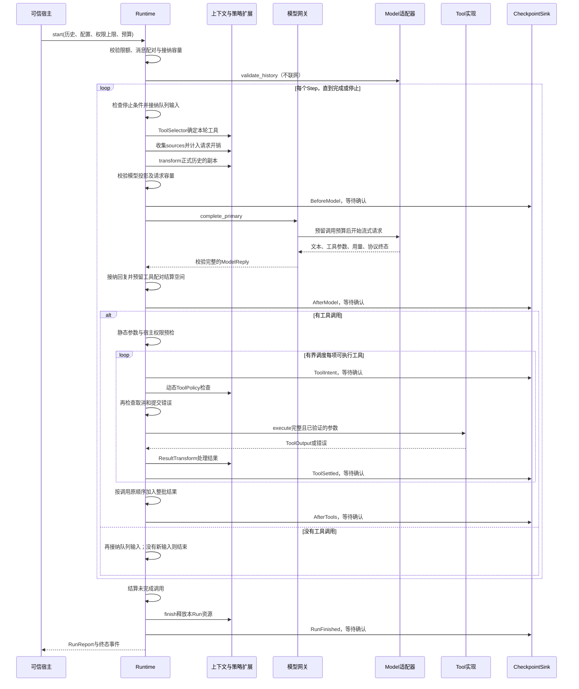
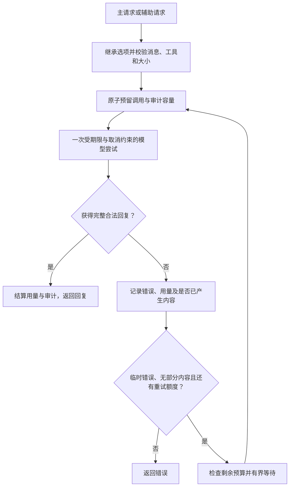
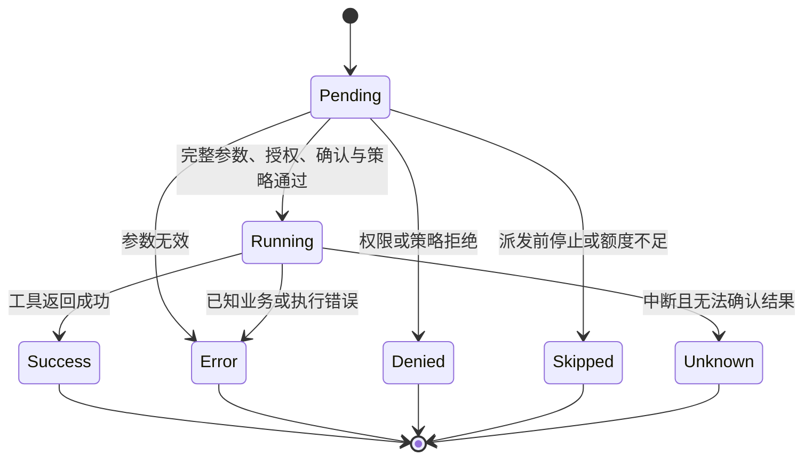

# 核心执行机制

[文档首页](../README.zh-CN.md) · [总体架构](OVERVIEW.zh-CN.md) · [上下文与记忆](CONTEXT-MEMORY.zh-CN.md)

本文描述 `api` 与默认 `runtime` 的执行契约。模型协议、工具业务逻辑、压缩算法和存储实现由扩展提供；Runtime 负责它们发生的时机、可执行条件与失败后的结算。

## 1. 调用入口与执行所有权

| 入口 | 语义 | 生命周期责任 |
|---|---|---|
| `HostBuilder::build()` | 完成注册、Schema 编译和 Plugin 安装，返回可执行 Host | 宿主保留 Host，并显式等待 `shutdown()` |
| `AgentRuntime::start(request)` | 校验并启动一个 Run，返回控制句柄与预先创建的事件接收器 | 丢弃句柄不取消 Run；取消需调用 `cancel()` 或关闭宿主 |
| `AgentExecutor::execute(request)` | 等待本次执行的完整报告 | Engine 使用 `wait_owned()`；丢弃未完成的拥有型 Future 会取消该 Run |
| `RunHandle::wait()` / `RunSession::wait()` | 只观察已有运行的结算 | 停止等待不取消任务 |
| `RunSession::steer(text)` | 将新输入放入有界队列，等待循环边界接纳 | 成功仅表示接纳，不表示模型已经执行该要求 |

`start` 的参数、模型历史预检等可以同步失败，此时返回错误而没有可供订阅的已启动 Run。已经启动的执行通常通过 `RunReport.status/error` 表达成功或失败；拿到 `Ok(report)` 不代表任务成功，应检查 `status`。

Run 的历史来自 `RunRequest.messages`。每次调用只传一句新问题，不会自动继承某个全局“上一次对话”。多轮会话由可信宿主或 Sessions 恢复并传入历史，见[上下文与三类记忆](CONTEXT-MEMORY.zh-CN.md)。

`TaskControl` 可在多个 Run 间共享预算、总期限和任务级取消。单个 Run 的取消令牌是其子令牌，取消一个 Run 不应顺手取消同一 Task 的其他 Run。

## 2. 一次 Run 的执行流程

下面是主循环的成功路径。标有检查点的步骤在安装 Sink 时等待确认；没有 Sink 时不执行存储 I/O。

这里的 `BeforeModel` 只约束主循环调用。压缩等扩展可能在构造投影时发起辅助模型调用，它们仍受统一网关约束，但不会自动生成另一套检查点循环。

运行中输入先验证容量与消息合法性，再确认 `InputApplied`，然后加入正式历史。拒绝的输入不返回成功接纳回执；也不会插进尚未完整配对的工具批次。

## 3. 模型网关：一个调用入口，一套预算

主对话、摘要以及工具内部需要的辅助模型请求统一经过 `ModelCaller`。网关负责请求与输出限制、调用预留、期限、取消、审计和完整响应收集；原始 Model 适配器只负责协议和流事件。

默认 `max_retries = 0`。开启后，仅 `ModelTransport`、`ModelRateLimit`、`ModelServer` 且未产生模型内容的失败进入有限重试。鉴权、额度、参数/协议错误、截断和部分输出不自动重试。文本、推理、工具调用和私有回传数据都算内容，不只是 UI 已经显示的文本。

每次实际尝试独立占用模型调用预算并记录审计。等待前后检查取消、总期限、剩余调用和审计容量；已经没预算就不先睡眠。可用的供应商等待时间在配置允许范围内采用，超出允许等待上限则返回失败，而不是无视其要求提前重试。

供应商明确报告上下文超限时，执行器最多给上下文管道一次恢复机会，且只在未产生输出、请求严格变小并仍通过校验后重发。它不是无限摘要/重试循环，也不重跑已经执行的工具。

流式 `Text` 或 `ToolDelta` 只是暂态输入。只有结束原因、完整传输、参数 JSON、调用编号与本轮声明集合全部合法，才形成可接纳的完整回复。流断开、半截参数或输出截断不能授权工具执行。

## 4. 工具调度与结果语义

注册时冻结 `ToolSpec`，编译 JSON Schema Draft 7，只接受文档内 `$ref`。每轮选择器只能缩小宿主允许的工具集合；计量、模型请求和派发校验使用同一份集合，重试与上下文恢复不重新选择。

参数校验失败会生成有限的字段路径和原因，供模型修正；不回显完整参数、不自动修复参数，也不进入工具函数。注册了工具，不等于获得副作用授权。

动态 `ToolPolicy` 位于 intent 确认之后、真实派发之前。前一个独占工具修改规则后，同批后续工具按新状态检查；intent 只证明保存了派发意图，不证明工具已经启动。策略 `Deny` 形成未执行结果；策略异常还会阻止后续新派发。

| 调度声明 | 含义 | 不提供的保证 |
|---|---|---|
| `Exclusive` | 与本 Run 同批次的其他工具分组顺序执行 | 不是跨 Run、跨进程或整个工作区的全局锁 |
| `ParallelSafe` | 同组可在 `max_parallel_tools` 与历史预留额度内并发 | 不验证工具实现是否真的线程安全；声明由可信扩展负责 |

并行工具可以按完成顺序发事件，但最终结果按模型调用原顺序进入正式历史。业务不应根据完成事件先后去重排模型的工具结果。

| 最终 `ToolStatus` | 含义 | 是否能推断副作用 |
|---|---|---|
| `Success` | 工具明确返回成功输出 | 只代表该工具报告的动作成功，不代表整个任务目标通过验收 |
| `Error` | 参数/业务错误或已知执行异常 | 不能仅凭 Error 推断外部操作已回滚 |
| `Denied` | 宿主权限或策略拒绝，未进入工具函数 | 本次没有执行工具主体 |
| `Skipped` | 尚未派发就停止、没有额度或前置条件失败 | 本次没有执行工具主体 |
| `Unknown` | 已进入执行但中断后无法确认最终结果 | 必须保留不确定性，禁止无条件自动重跑 |

普通业务错误可以作为观察交给下一轮模型处理；取消、期限、预算、检查点或结果治理的致命错误会终止 Run。结果变换不得改变 call_id 或执行状态，归档失败也不能用重做原工具解决。

下图表示一次工具调用的抽象状态路径，终点对应正式 `ToolStatus`，不是新增的 API 枚举。参数错误可在派发前进入 Error；策略拒绝可在 intent 保存后进入 Denied，但都没有进入工具主体。

## 5. 历史与资源预算

| 限制 | 保护的对象 | 与其他限额的关系 |
|---|---|---|
| `max_initial_history_bytes` | Run 启动前接纳的规范历史 | 允许大于最终请求限额，以便历史先进入压缩 |
| `max_history_bytes` | Run 内实际保留并持续追加的规范历史 | 摘要缩小的是投影，不释放这份历史的额度 |
| `max_context_bytes` | 实际交给 Model 的规范化请求 | 包含本轮工具、来源、消息、选项和输出预算字段 |
| `max_response_bytes` / `max_tool_result_bytes` | 单次模型收集和单项工具结果 | 不能用总体步骤数代替 |
| `max_steps` / `max_tools_per_step` | 主循环轮数和单轮工具调用数 | 摘要与重试也会调用模型，另受 Task 调用预算限制 |
| `TaskLimits` | 共享任务期限、模型调用次数、已报告用量熔断 | 新建子 Run 时应共享同一 Task，而非重置预算 |
| `max_audit_bytes` / `max_checkpoint_bytes` | 审计保留和单次提交快照 | 独立于 UI 缓存；达到上限有明确失败语义 |

默认值集中定义在 [`api/src/run.rs`](../../packages/api/src/run.rs)。这些字节限制以规范序列化对象计量，不等于进程 RSS 或供应商最终 wire body 的精确大小；Provider 仍需实现自己的传输边界。原生工具在返回前分配的巨大对象，也不能由返回后的限额检查撤销。

模型回复入历史前先预留全部调用的最小结算记录；派发每项工具前再按最大允许结果与 JSON 转义上界预留空间。空间被在途工具暂时占用时先等待其结算、释放余量；确定不足时停止新派发，不为腾空间取消已开始的工具，也不删掉旧事实。

已报告 token 是事后用量，不是预付费账单。用量缺失或失败时标记不完整；本地估算和熔断不能承诺费用绝不超出精确金额。

## 6. 检查点与可靠提交

`CheckpointSink` 可选，Host 最多注册一个。执行器只规定提交时机、精确快照和等待语义；后端负责耐久保存、重复提交处理与权限。

| 阶段 | 必须确认后才继续什么 |
|---|---|
| `InputApplied` | 确认运行中输入已被接纳 |
| `BeforeModel` | 发出该轮主模型请求 |
| `AfterModel` | 在回复已入正式记录后进入后续工具流程 |
| `ToolIntent` | 动态策略与工具派发；确认后仍检查停止条件 |
| `ToolSettled` | 已调度调用的局部结果结算；静态预检拒绝可随批次保存 |
| `AfterTools` | 整批结果入历史后进入下一轮 |
| `RunFinished` | 发布最终成功状态与报告 |

同一 Run 的提交串行化；不同 Run 可能并发调用同一个 Sink。批次中的检查点可能暂含未配对调用，其局部结果放在 `pending_tools`，不能直接当成完整模型请求重放。

确认失败后不再正常启动后续模型或工具；已经派发的并行工具按取消/结算规则收尾。成功动作不会因为保存失败被伪装成没有发生。终态保存失败时不能返回正常 `Completed`；若原本已经失败或取消，则保留原停止原因，并记录检查点故障。

快照通过独立、有期限的结算令牌提交，避免用户取消后连终态都无法保存。确认丢失仍有歧义：磁盘可能已经写入。Checkpoint 不提供外部副作用事务，也没有内置 `resume(checkpoint)` 或自动崩溃续跑。

## 7. 事件、审计与最终报告

| 对象 | 用途 | 使用者 |
|---|---|---|
| `RunReport` / Transcript | 当前 Run 的完整结算信息 | 可信 Rust 宿主、会话扩展 |
| `RequestAudit` | 每次模型尝试的大小、用量、错误及按模式保留的请求 | 可信诊断，不直接给 UI |
| `RunSnapshot` / `WorkItem` | 有界执行展示状态 | Application、Client、UI |
| `EventEnvelope` | 带 run_id 和递增 seq 的暂态执行更新 | 实时订阅与应用投影 |

`AuditMode::Full` 保留规范化请求及有限的失败部分文本；`Metadata` 明确令 request 为 null，也不保存失败部分正文。两者都计入容量，精简审计不代表会话、检查点或工具正文自动脱敏。

UI 项可能被裁剪，Runtime 另行维护活动项，仍能完成结算和发终态。原始订阅只接收未来事件；Lagged 后应恢复快照。需要游标回放时使用 Application，而不是把 broadcast 当成持久日志。

`RunStatus` 的终态为 `Completed`、`Failed`、`Cancelled`、`TimedOut`、`Limited`。Run 运行中不应伪造一个终态；模型文本已经显示、工具完成、HTTP 成功和 Run 成功是四种不同事实。

## 8. 停止与关闭

执行结束先处理未完成调用，再等待上下文/结果变换器释放本 Run 资源，随后提交终态并发布报告。`EventObserver` 是可丢失的旁路观察，不能负责可靠保存、扣费或唯一的资源清理。

Host 的正常关闭顺序为：禁止新 Run、取消并排空已有 Run、撤销注册表、逆序关闭 Plugin。排空超时保留资源，宿主可以等工作结算后再调用关闭；直接 drop 不能等待异步清理。

原生插件必须合作式响应取消并管理自己的进程/线程。Task 期限不是操作系统强杀，也不是回滚保证。需要硬隔离时应使用受控进程或其他宿主执行后端。

## 源码定位

| 关注点 | 源码 |
|---|---|
| 执行入口与循环 | [`engine.rs`](../../packages/runtime/src/engine.rs)、[`streaming.rs`](../../packages/api/src/streaming.rs) |
| 模型收集、重试与审计 | [`model.rs`](../../packages/runtime/src/model.rs)、[`api/model.rs`](../../packages/api/src/model.rs) |
| 工具预检与调度 | [`tools.rs`](../../packages/runtime/src/tools.rs)、[`api/tool.rs`](../../packages/api/src/tool.rs) |
| 历史计量与结果预留 | [`history.rs`](../../packages/runtime/src/history.rs)、[`api/run.rs`](../../packages/api/src/run.rs) |
| 检查点 | [`checkpoint.rs`](../../packages/runtime/src/checkpoint.rs)、[`api/checkpoint.rs`](../../packages/api/src/checkpoint.rs) |
| 事件与生命周期 | [`events.rs`](../../packages/runtime/src/events.rs)、[`host.rs`](../../packages/runtime/src/host.rs)、[`gate.rs`](../../packages/runtime/src/gate.rs) |
