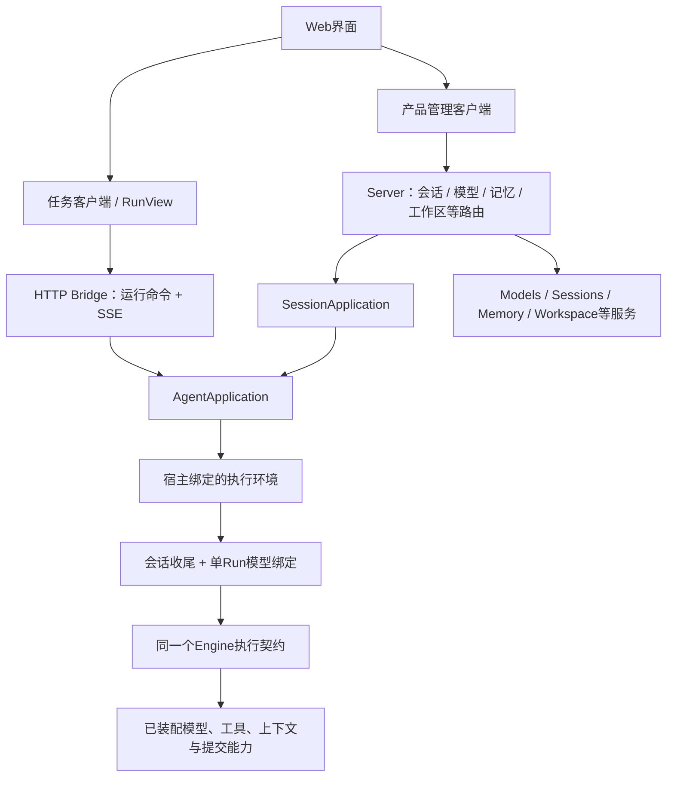
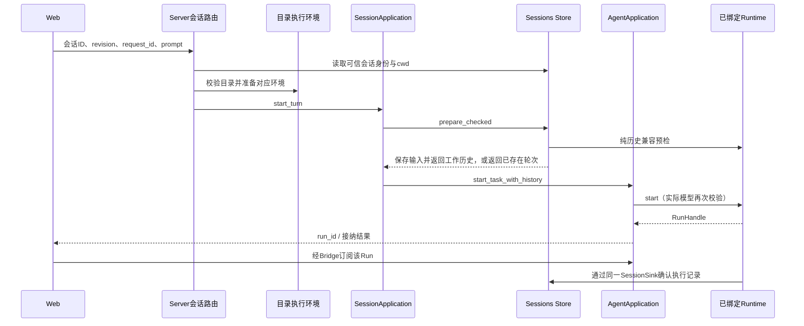
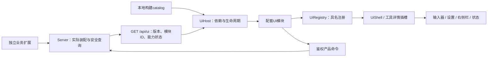

# 应用层与 Web/桌面装配

[文档首页](../README.zh-CN.md) · [总体架构](OVERVIEW.zh-CN.md) · [核心执行](RUNTIME.zh-CN.md)

本文面向替换前端、改造 Server、接入桌面或复用产品接口的开发者。它说明已有模块的调用关系、权限和生命周期，不逐一列出界面按钮，也不将应用层能力当成 Core 的强制依赖。

## 1. 应用层不是另一个执行器

| 部分 | 职责 | 不应承担 |
|---|---|---|
| `application` | 通过 `AgentRuntime` 管理启动、取消、输入幂等、结果、订阅、回放和保留策略 | 供应商协议、具体工具、文件会话存储实现 |
| `http-bridge` | 将统一任务接口映射到 HTTP JSON 与 SSE | 构造 Engine、绑定监听端口、实现产品管理数据库 |
| `tauri-bridge` | 将同一任务接口映射到 Tauri Command/Channel，并管理 IPC ACK | 强制启动 HTTP 或自动补齐所有 Web 管理接口 |
| `client` | 框架无关的协议客户端、SSE/IPC 消费与 `RunView` 归并 | UI 组件、模型调用、工具调度或持久会话 |
| `apps/server` | 组合扩展，决定目录、权限域、配置、端口及产品路由 | 复制扩展实现，或把页面操作写进 Runtime |
| `apps/web` | 连接状态、交互、展示与产品管理客户端 | 可信权限判定、直接保存模型密钥或执行底层循环 |
| `apps/desktop` | Tauri 受信窗口、本机能力、静态页面与同进程 Rust 服务生命周期 | 另一套 Agent 后端或强制改用 IPC 的业务接口 |

当前主界面使用原生 JavaScript 模块、HTML 和 CSS，Client 不要求 React/Vue。局部文档预览有自己的隔离宿主和按需资源，不改变 Agent 执行和通用 Client 的技术边界。

## 2. 两条调用路径

通用 `/v1/runs` 是临时运行入口；持久聊天由 Server 的会话接口接纳，再进入相同的 Application 与 Runtime。不能把通用启动接口的 `request_id` 当成持久聊天身份。

模型设置和记忆管理不注册成拥有管理权限的模型工具。页面通过受鉴权的管理 API 配置扩展；模型只获得宿主明确注册并授权的运行工具。

## 3. Server 启动和配置生效

组合根先读取能力策略和工作区设置，打开 Sessions，再创建环境工厂。工厂持有模型管理/固定模型、Compactor、Spill、Memory 和历史检索等启用的能力。每个实际工作目录在需要时构造并复用执行环境，不修改进程全局 cwd。

| 配置对象 | 谁决定 | 生效边界 |
|---|---|---|
| 能力是否编译 | Cargo features | 没编译的能力不能靠页面开关产生 |
| 组件/工具是否启用、能否由用户修改 | 部署策略 + 允许的用户选择 | Host 重建/重启时装配，不更改活动注册表 |
| 模型、协议、端点、凭据与能力 | Models 管理或固定模型宿主配置 | 每个 Run 启动时绑定；后续设置变化不改变已运行任务 |
| 普通会话默认目录根 | 工作区设置 | 只影响新会话；已保存 cwd 不随切换而迁移 |
| Memory 条目 | 已授权后端 | 后续模型请求构造时刷新，不等待永久冻结的会话快照 |
| UI 展开、布局等偏好 | 页面 | 不改变任务身份、工具权限或执行目录 |

`models` 路由 Plugin 与 `manager.runtime(...)` 应配套；直接注入固定 Model 时不再同时注册同名模型服务。空模型设置是有效的首次启动状态，不意味着允许无配置自动切换假模型。

本地开发入口 `npm run dev:web` 启动真实 Rust Server 与正式 Web，使用开发启动器生成或读取的宿主凭据；不要求 `.env`。显式离线演示与真实调用是不同入口，失败不得自动降级成演示模型。

## 4. 持久会话的一轮输入

图中为新轮次成功路径。重复的已保存请求直接返回已有身份，不再次启动。revision 冲突、历史不兼容或容量不足在相应边界明确失败；预检之后发生模型配置竞态时，实际启动仍会拦截，不向错误模型发送私有历史。

会话接纳不因 HTTP 调用者断开而丢失所有权。客户端结果未知时应使用同一逻辑 request_id 查询或重发，不能另造 ID 假装是同一次操作。

会话的磁盘寿命与 Application 内存 Run 注册表不同：内存记录 TTL 到期不删除会话；删除已结束会话也不删除其工作目录中的用户文件。重启恢复已确认历史并标记中断，不自动继续外部副作用。

## 5. 通用调用面与可信调用面

| 调用面 | 典型操作 | 可接受的数据 |
|---|---|---|
| 通用任务接口 | start、cancel、input、snapshot、result、events、forget | request_id、文本、run_id、游标等受限字段 |
| 可信 Rust 宿主 | `start_task_with_history`、`wait_report` | 经宿主验证的历史/metadata；完整报告可能含私有信息 |
| 产品管理接口 | 会话、模型配置、能力、记忆、工作区 | 对应管理契约；由当前认证和管理权限约束 |

通用任务请求不能覆盖系统提示词、工具集合、运行预算、凭据或任意目录。**这不等于管理页面不能配置模型**：模型管理 API 属于另一条可信产品管理路径，不能向它照搬“普通运行用户”的默认授权。

当前 Web Server 是单一可信宿主权限域，使用 Bearer 保护任务和管理接口。公网或多用户产品需要区分管理员、普通用户及各自数据范围；仅添加一个 prompt 中的 user_id 或项目目录并不会建立租户隔离。

## 6. 事件、回放和页面归并

核心发出 `EventEnvelope`，Application 投影为 `StreamFrame`，包含 event、snapshot 或 fault。HTTP 通过 SSE 传递；Tauri 外层再附 subscription_id 和 delivery_id，用于 Channel 的确认。

| 标识 | 用途 | 不能用于 |
|---|---|---|
| `run_id` | 运行身份 | 直接证明用户有访问权 |
| `seq` / `after` | 已消费的 Run 事件游标 | 持久会话版本或工具幂等键 |
| 会话 `revision` | 防止更新覆盖较新持久状态 | SSE 重连位置 |
| 检查点 `revision` | 一次 Run 的确认顺序 | UI 动画进度 |
| Tauri `delivery_id` | 单次 IPC 包 ACK | 替代模型调用编号或 Run seq |

`RunView` 按顺序接纳更新；完成项覆盖已有项，不再把最终全文追加到之前的 token 后面。收到恢复 snapshot 时替换旧投影。过旧游标、源事件缺口或慢消费可能丢失中间动画，不能继续拼接一段不完整字符串当作完整结果。

Application 的 journal 是有界内存回放，不是磁盘事件日志。原始 Runtime 订阅只观察未来事件；需要恢复时由快照/应用回放处理。HTTP Client 使用带鉴权头的 fetch 消费 SSE，不把 Token 放到 URL。

关闭订阅、页面断线、Tauri ACK 超时不等于取消任务；停止按钮使用明确的取消操作。看到文本或工具完成也不等于 Run 成功，界面最终以 RunOutcome 为准。

## 7. 展示数据与私有数据分离

公开任务结果使用 `RunOutcome` 和有界 `RunSnapshot`，不直接序列化完整 `RunReport`、RequestAudit 或 RunCheckpoint。

`UiToolResult` 是独立的展示投影，当前可含有限文本、受限内嵌图片与资源描述；并非仅有文本占位符。远程图片地址、隐藏推理、ProviderData 和任意 structured 数据不默认透传。普通工具文本仍可能敏感，UI 转义不是内容脱敏。

页面渲染、文件预览与工具执行是三条不同路径。用户查看文件、运行交互终端或查看 Git diff 是应用层操作，不应伪造一条 Agent 工具事件。工具参数增量、预览 HTML 或历史原文都不是浏览器可以执行的程序指令。

Office/HTML 等预览必须在其受限预览宿主中处理；文档内容不获得主页面的 Bearer、会话对象或模型配置。更换渲染库时应保持这个隔离边界，而不是直接把模型输出写入主页面。

### 正文与文件展示适配

`TurnView` 接收由宿主客户端组装的 presentation 上下文：`contextKey`、`openFile`、`readMedia`、`describeFile`、`onError`。它们绑定来源会话/项目和当前连接代次，不在点击时改用全局选择的目录。`presentation-path` 只做展示层路径解析与行号定位；最终读权限仍由 Workspace/Server 校验。`/api/workbench/{kind}/{id}/stat` 返回受限元信息用于文件卡片，不为确认文件存在而下载正文。

`content-renderer` 依据解析结果而不是操作后 DOM 是否相同来决定复用。代码的折叠、换行和文本选区不属于模型内容；追加段落递归复用未变的行内文本与代码，不因一个行内操作按钮重建整个段落；变化的文件目标仍重建授权回调，丢弃的新资源节点会释放读取；异步解析、图片、高亮与文件请求均有身份或代次检查，消息关闭后释放对应资源。大段文本使用 Worker，工作项详情、图表和文件内容按需读取；源/输出/队列都有边界，失败显示原文或明确不可用，不遗漏输入后伪装成完整结果。图表引擎可支持实际 Mermaid 图类型，但解析错误、预算限制或被安全策略阻止时仍回到完整源码。 每条消息持有独立取消信号；释放消息立即结束其等待中的解析请求并移除定时器和回调，晚到的 Worker 结果不再提交，不为取消一条消息终止其他消息的共享 Worker。已进入 Worker 的计算可能继续到完成，但不再保留失效视图的待处理结果。

`conversation-controls` 管理阅读意图、锚点、字面查找与选区引用；Sessions 客户端按游标追加历史，失败区域可独立重试。它们不截断可信历史、不调用模型搜索、不生成持久执行事实。浏览器会话内查找只覆盖已读取的正文/工具内容，继续搜索显式加载更多历史；主任务运行时不能借查找自动切换执行上下文。 阅读补偿记录作用域和用户滚动代次，异步历史完成不得恢复到用户已经离开的旧位置；每次历史插入在实际提交前采样锚点。内部代码/日志滚动只改变自身位置。关闭正文查找清理待执行的高亮任务；任务搜索的输入、打开和关闭均使前一代查询失效。

右侧 `RightPane` 按端点和会话/项目保存有界文件标签元数据；恢复标签必须重新获得当前身份的文件读取能力，不能恢复旧 Token 或重放终端命令。文件只读预览、真实 Git 差异与任务当时的 Diff 是不同来源；前者读取当前文件，后者展示既有结构化快照，不暗示文件自动回滚。`FilePreview` 分页复用代码容器，版本冲突停止拼接并允许刷新。 二进制预览通过 `prepareBinary` 在稳定父容器内准备候选文档：获得授权字节、完成 Office 渲染后再提交新版本和显示；失败释放候选资源而保留上次确认的 iframe。候选的请求取消与已提交文档的生命周期分开，下一次刷新不会提前销毁旧文档；关闭标签会取消候选并释放已提交的 Blob、媒体和事件监听。

`content-dom.previewDialog` 接受来源 `owner`；正文表格、图片和图表的放大视图由来源持有。销毁、隐藏或使来源不可交互时关闭对应弹窗，关闭后仅恢复可见且可交互的触发项。排入微任务的文件操作在提交前重新检查来源和消息取消信号；本地图片失败重试沿用原授权读取接口，不扩大目录权限，也不创建 Run。

用户交互终端是独立 PTY 服务，输出重连使用字节游标；输入序号和未知确认阻止重复写入。临时旁支和主会话共用工作目录但不共用可写聊天历史。连接断开不等于任务终止，页面保持未知状态并提供观察性重连，而不是重新发送一轮任务。

### 布局与输入器

`shell-layout` 负责通用导航和输入器几何，不承担工作区选择或 Agent 执行。`NavigationLayout` 保留用户宽度偏好，再由 `layout-geometry` 与 `RightPane.fitColumns` 按当前空间计算实际列宽；保护聊天列，右栏无法满足最低宽度时才浮层化。`overlay-scope` 按所有者维护基础可交互状态和当前模态区域，避免左右侧栏分别保存/恢复过期的 inert 值。导航关闭、右栏全屏和视口切换只改变展示，不取消任务。

`ComposerLayout` 用不可访问的纯文本测量区计算草稿高度，以一次动画帧合并内容、控件和尺寸变化；保留实际 textarea、选择区与输入法状态。上限由既有 Token 和可见阅读空间共同约束；滚动条宽度只作为受控 CSS 布局变量同步到输入器、停靠卡和统计。扩展仍通过现有模式、操作、停靠和状态 Slot 插入，不依赖新的 Core 字段。

空态 LOGO/标题与 `.composer-wrap` 共用现有工作区网格；`welcome.hidden` 驱动居中或底部停靠，仅改变 CSS，不重挂输入器。输入器底部操作行左侧依次承载 `+`、`composer.mode` 贡献，右侧承载模型与发送；项目等真实上下文仍可单独显示在输入器上方。Planner 通过 `composer.commands` 从 `+` 菜单进入，仅在计划模式已由宿主确认时向 `composer.mode` 显示活动状态按钮；普通执行不占一个常驻模式控件。

### 展示策略与只读统计

`conversation-policy` 以展示策略控制整轮、过程组和单工具披露，连续工具的组边界来自可见回复，不按工具种类或 model step 强行分组。旧页前置时保留已有组身份；补充用户输入不能被整体折叠。准备中的参数不是已执行工具，不解析半段 JSON 为可点击文件或执行结果。策略只操作展示，不修改历史、模型请求、预算或授权。 `process-scroll` 为每个工具组持有独立阅读意图与成员锚点，监听内容尺寸并在关闭组件时释放；模式切换仅改变组披露和高度上限，不重挂成员。外层轮次状态与组内当前动作分工显示，失败与断连不使用完成文案。

`GET /api/workbench/session/{id}/statistics` 是现有 Bearer 权限域内的应用查询接口。`conversation_metrics` 汇总完整会话档案与最新检查点中的实际步数、`TaskUsage` 和 `RunStatistics`，不返回历史正文、ProviderData 或凭据。每轮统计随原有检查点原子保存；查询不调用模型，也不依赖当前浏览器已加载的历史页。

宿主把只读 `ContextMeter` 装配为本轮最后一个 `ContextTransform`，观测压缩后的主请求及绑定模型窗口，原样返回投影。发送前优先使用 `ModelCaller.estimate_input_tokens`；没有供应商锚点时按请求约 3 字节/token 估算。主请求成功并报告用量后，以实际输入总量校准占用。系统、工具和消息分项使用同一估算密度，不能当作供应商账单。观测随本 Run 的检查点保存，刷新后仍可显示；未知窗口不计算百分比。供应商缓存桶缺失时命中率为空，生成样本不足时速度为空。统计详情复用 `pane-controls` 的顶层定位与关闭生命周期，不改变模型请求、预算或授权。

右侧文件树由 `WorkspaceFiles` 持有自己的目标和连接副本，不再切换左侧导航模式；文件、预览、终端依照同一会话的标签生命周期管理。全屏/并看只改变布局，不重新挂载内容或恢复执行副作用。保存布局只含白名单文件描述和显示偏好；终端、临时旁支不作为刷新时的自动执行指令。

`pane-layout`保存每个scope的两个有序标签组、独立活动项、焦点组与分隔比例；`RightPane`用CSS Grid呈现，预览节点不移出稳定内容父节点，以免iframe重载。`PaneState`当前格式版本2验证完整分组成员关系、去重、路径和容量边界，写入失败不发布未确认记录。模块仍通过拥有者代理注册和打开标签，布局不改变其所有权或工作区权限。

`pane-controls`提供有限图标操作与顶层菜单，只写受控菜单坐标和分隔比例CSS变量，不接受模型样式。菜单所属面板被隐藏时关闭，销毁时释放事件和观察器。文件目录与搜索各持有请求代次及取消域；搜索不拆卸浏览树。预览刷新先读新页，确认成功后替换当前内容；失败明确保留旧视图，版本冲突不继续拼接。 `FilePreview.focusLine` 在模式布局恢复后定位，仅滚动自身文件视口；连续引用以最新请求为准，不把源码查看误当成页面级导航。拖动宽度和键盘宽度调整经过同一布局刷新路径，即时更新窗格排列与控件可用性。

## 8. 工作目录、项目与旁支

普通 Web 会话由宿主在默认根下分配稳定目录，项目会话绑定登记目录；项目是可选组织能力，不是执行前必须创建的隐藏对象。活动 Run 持有启动时的执行环境，切换会话、项目或标签不会改变它的 cwd 和工具配置。

项目创建方式由宿主能力决定。HTTP Web 宿主报告 `project_create_mode: name`，鉴权后的 `/api/projects/create` 只接收名称，在当前默认工作区下创建同名目录并复用项目登记的路径校验与版本提交；Web 页面不传任意绝对路径。`apps/desktop` 加载同一页面并将项目入口切为 `folder`：Tauri 原生对话框由受信主窗口调用，选定目录后交给同进程产品服务校验和登记。

当前临时侧边对话复用 Application/Runtime，接收宿主恢复的父会话上下文，自己维护后续临时历史；不是持久会话树。它可以继承父会话的历史读取范围，但不取得向父轮次提交记录的身份。关闭或重启不表示存在自动恢复旁支的能力。

工作目录限定访问、Memory 空间、项目历史权限和终端进程权限分别处理。两项目共享同一个目录，不表示会话历史自动互通；同目录并发执行也不是文件事务或操作系统沙箱。

## 9. 更换前端或接入 Tauri

替换前端时保留 Client/RunView 的协议语义，将渲染映射到自己的组件。管理 API 的客户端独立于通用任务 Client；新界面不应通过暴露完整 RunReport 省略这层边界。

正式桌面入口 `apps/desktop` 直接复用 Web 静态资源和 `apps/server` 库，在同一进程的随机环回端口提供完整产品 API；Tauri 仅拥有受信窗口、连接信息与原生文件夹选择。服务与桌面窗口共用同一 Agent 执行循环，关闭窗口后有序停止服务。`tauri-bridge` 仍可供只需原生 Command/Channel 的其他嵌入宿主使用；其通用任务命令不会自动提供会话和项目管理。

Application 的关闭和 Host 的关闭也应分开：先停止接入、取消并等待任务，再关闭 Host/扩展和独立产品资源。临时终端和文件预览资源由其产品宿主管理，不依赖模型最终回复触发回收。

Planner 的产品配套模块通过 `composer.commands`、活动状态插槽和右侧计划面板装配，标准宿主默认普通执行且不显示常驻“执行模式”。显式计划模式从 `+` 菜单进入，确认后才显示“计划”状态；此模式仅开放宿主列出的只读调研工具，提交方案后可以查看、请求修改或明确继续。模式不是纯浏览器变量，恢复与派发限制由宿主和 Planner 实现，详见下节。

## 10. 产品 UI 模块与插槽

本机制参考 DSH 的 [Client Module](https://github.com/deepseek-ai/deepseek-harness/blob/master/docs/subsystems/client-modules.md) 与 [Slot](https://github.com/deepseek-ai/deepseek-harness/blob/master/docs/subsystems/slots.zh.md) 分工：业务能力、浏览器配套模块和布局外壳分别维护。Mona 使用 Rust 业务组件、原生 ES Module 和有限注册器，不引入 Cordis、React、远程插件分发或新的执行循环。

### 装配清单不等于执行权限

`GET /api/ui` 沿用产品 Bearer、CORS 和 no-store，版本为 1。模块清单只有稳定 ID；`ui/catalog.mjs` 将 ID 映射到本构建内固定的加载函数。服务器、模型和文件内容均不能提供任意可执行 JS 地址。模块版本和加载函数不匹配时，该模块报错，不退回旧协议猜测。

能力条目同时描述 compiled、enabled、active、configurable、restart_required。`enabled` 是保存的期望值，`active` 是当前宿主装配，改变开关仍需按现有规则重启；UI 列表刷新不是后端热插拔。设置入口、历史只读渲染与新的执行操作分别判断：关闭 Planner 不隐藏已保存计划，关闭组件也不删除 Memory 或会话；未编译的能力不能通过前端声明产生。

`PluginManifest` 不增加 UI 字段。具体业务通过自己的普通接口被 Server 调用，配套 UI 在 `apps/web/ui/modules` 中注册。增加一种模块需加入构建 catalog 和宿主装配表；已有插槽内的新模块不需要改写 `app.mjs` 的功能分支。新的业务接口仍需开发，不存在从名称自动生成完整交互的机制。

### 有限的注册位置

| Slot | 合同与用途 |
|---|---|
| `settings` | 导航按钮、内容节点与激活回调；可组合多个后端能力，不按 Rust 包强制一页 |
| `composer.actions` / `composer.mode` | 受信模块提供输入器底部控件；`composer.mode` 用于权限或已激活状态，不要求每种工作方式常驻一个下拉 |
| `composer.dock` | 输入器上方的辅助状态区，例如当前计划 |
| `composer.commands` | 命令处理函数或 `{run, menu}`；同一注册表供斜杠分发与 `+` 菜单使用，未声明 menu 的命令不占菜单项 |
| `status` | 已有会话、用量和上下文统计，不改变 Runtime 计量 |
| `right.pane` | 注册可用性判断与打开动作，复用同一个 RightPane 和其标签生命周期 |
| `tool.view` | 按命名空间详情键选择专用渲染器；未知或失败时使用安全 JSON 回退 |
| `presentation` | 组合绑定来源会话的文件读取、归档与展示回调，不直接授予文件访问权 |

每项声明包含 owner、id、order 和具体值。未知插槽、重复 ID、无效顺序或超过容量时明确拒绝。每槽最多 64 项，按 order/id 稳定排序；不依赖异步模块返回顺序。设置与工具专用视图只改变展示，不复制执行历史。

`ui/commands.mjs` 统一分组、声明校验和执行前可用性检查；`ui/command-menu.mjs` 复用既有 `PaneMenu` 的顶层浮层、焦点与清理机制，仅增加输入框同宽定位。菜单元数据和动作归具体模块，外壳不持有 Planner、Sandbox 或模型业务分支。`ctx.refreshCommands()` 只通知展示刷新，模块释放后失效；未变化的条目保留节点，移除条目后旧按钮不能再执行。实际接口、模式保存与运行预算不变。

### 生命周期与会话隔离

`UiHost` 解析显式依赖，检测缺失与循环；子模块等待依赖的 `mount` 完成，不能把装配占位视为已就绪服务。并发清单刷新共享同一挂载结果；新加入的模块依次取得当前连接和选中会话，已有模块不重复初始化。每次注册返回幂等释放函数，`ctx.own`、`ctx.listen`、`ctx.on` 将资源绑定模块；连接更换使旧代次的加载与请求结果失效。卸载后的上下文不能再取得新连接、服务或占用输入器。

面板与文件访问按端点、会话或项目绑定。Memory、模型设置等控制器持有本次挂载的 DOM 根，旧请求不能写入新连接的节点；Plan API 响应核对 Session ID、revision，模式写入同时受会话与计划版本约束。UI 模块退出会撤销自己的订阅、监听器、定时器和标签，不自动取消 Agent，不删除持久数据。明确点击停止、关闭交互资源与被动断开仍是不同操作。

无效的 DOM 贡献被所在插槽跳过并报告，不阻止同槽内其他正常控件；设置导航按 order/id 排列，撤销时移除所属节点与监听。清理函数或错误提示自身抛错不阻止其他模块释放。工具渲染失败有局部回退，模块装配错误通过界面提示。此隔离保护生命周期和可用性，不是安全沙箱：同源 JS 模块和 Rust 原生扩展仍为可信代码。模型输出、历史正文和 Office/HTML 预览不能成为可信 UI 插件，已有受限预览宿主保持隔离。

### Planner 从页面到执行的可靠路径

`GET /api/sessions/{id}/plan` 返回经过类型和容量检查的计划投影，不传完整 Checkpoint。POST 只接受会话 revision、计划 revision 与 plan/normal/refine/resume/reset 枚举动作。空闲模式切换先保存在 Sessions 的通用 `Body.state["planner"]`；失败不更新页面的权威模式，运行中或版本冲突拒绝修改。

面板操作绑定用户看到的会话和计划版本，旧按钮不能操作随后选中的另一会话，也不自动同意已被替换的方案。模式操作在首次异步等待前防重复提交，存在草稿时不先切换模式再报错。运行中采用限频读取；连续输出不推迟所有计划刷新，同会话的重叠读取合并，未变化的方案正文保留原 DOM。

启动轮次时，`SessionApplication::with_context` 在精确会话接纳锁中读取当前状态，生成可信 seed，再开始原有 Run。正在执行的计划工具结果由产品检查点适配器从当前检查点派生，通过 `Store::commit_with_state` 与检查点一次原子保存，不增加异步旁路或第二份计划数据库。格式 5 的通用扩展状态属于 Sessions；统计新增通用 `RunStatistics` 检查点字段，事件和 Plugin 契约不变。

提交方案后，页面可明确请求继续执行；宿主确认模式后，在同一会话发起下一轮，而不是每步创建 Run。普通模式不强制规划或审批。计划模式的只读限制通过已有 ToolSelector 与 ToolPolicy 实现，同批提交后的业务操作仍被拒绝。关闭 Planner 后仍处于 PlanOnly 的会话拒绝继续，防止撤下插件就变成无条件执行；临时旁支绑定自己的空计划，不继承父会话的可写计划身份。

桌面产品壳复用完整 HTTP 产品清单，Tauri 通用任务桥本身仍不承载这些管理接口。业务扩展在没有任何 UI 时仍可以独立使用。

### Sandbox 策略与原生执行

`sandbox` 扩展提供本机文件副作用约束，Tools 通过可选 `SandboxBinding` 接入同一策略：Shell 使用受限启动参数，write/edit 在原有原子修改路径中检查准确规范目标。读取和联网不在该三模式合同内，用户手动 PTY、宿主保存及原生进程内插件不自动受限。具体后端与平台差异见 [Sandbox](../../packages/sandbox/README.md)。

标准 Web 默认 `workspace-write`；Sandbox 在输入器底部 `composer.mode` 常驻文件权限控件，用户文案为“仅可查看 / 工作区内修改 / 完全权限”。Planner 不复用这三档权限：它通过 `+` 菜单进入计划模式，并只在活动时显示“计划”状态按钮。两者限制可以同时存在；模块从宿主读取实际模式、后端和 full/partial 状态，不以本地开关代替权限，也不增加审批流程。

`GET /api/sandbox` 查询默认策略，`GET/POST /api/sessions/{id}/sandbox` 查询或按当前会话 revision 保存模式；POST 只接受 revision 与 mode，根目录和临时身份由宿主确定。空闲模式保存到 Sessions 的 `Body.state["sandbox"]`；接纳下一轮时映射为可信 `mona.sandbox.mode`。运行中拒绝改变模式，检查点通过 ProductSink 将策略、计划投影和执行状态一次原子确认，未增加文件格式或异步保存旁路。尚未手动选择的默认策略也会随首次检查点保存。

`AGENT_SANDBOX_MODE` 锁定部署模式，`AGENT_SANDBOX=0` 关闭装配，两者冲突时拒绝启动。关闭或未编译 Sandbox 的宿主拒绝直接继续已要求限制的会话，不能把卸载组件当作自动放权。临时旁支取得父会话的沙箱策略，但不取得父会话持久提交身份。

原生 helper 在同步 main 的最前面分流，在创建 Tokio、载入配置或凭据之前运行。Tools 继续持有超时、输出和取消责任；进程树停止后才释放命令的临时授权租约。删除会话清理其私有临时资源，工作区用户文件保留；宿主停止任务后关闭 Sandbox。Windows 常驻工作区 ACL/Low 标签不在退出时反复恢复，异常强杀不承诺清理完所有临时目录。后端不可用明确报错，不重试为不受限执行。

### Subagent 委派与产品控制

`packages/subagent` 管理子会话与激活，不拥有另一套执行循环。Server 在每个实际环境提供 Driver，通过弱引用调用既有 Sessions/Runtime 装配；继承父 Run 的模型快照，或使用宿主角色指定的 Models 路由。父子共享预算和期限但拥有独立取消范围。子记录使用新的 Session/Turn 身份；fork 读取父任务模型请求前的已配对工作快照，随后历史独立增长，不复制当前未结算的工具批次。

配置接口 `GET/POST /api/subagents` 返回保存版本、当前有效配置、期望配置与部署锁定状态，变更先原子保存、重启生效。子任务列表与详情位于 `/api/sessions/{root}/agents`，详情最多列出最近 50 轮，每页最多 30 个安全工作项。公共响应不带系统提示词、Provider 私有历史或完整检查点。顶层会话导航隐藏子记录；根会话权限验证后才能查看或控制其子任务。

补充信息与后续任务使用不同接口：`message` 保存有界消息、不启动空闲子任务，`followup` 通过仍活动的父 Run 启动原有子会话的下一轮，`interrupt` 核对所见 Run 后停止并等待。主任务已结束时，Web 的继续操作回到主会话产生明确请求，不能无父任务预算独立续跑。父结束时必须收尾所属后代，未完成的工作不能当作成功；重启只恢复确认记录，中断不自动重放。

配套 UI 通过 `settings`、`right.pane`、`tool.view` 注册；显示实际角色、模型、状态、用量和执行片段。权限始终与父任务当前工具集合相交，Planner/Sandbox 的约束不能通过子任务绕过；角色的空工具集合与继承不同。共享目录不提供自动工作树或冲突合并，业务成功仍由主 Agent 核对。完整能力、来源许可和嵌入方法见 [Subagent](../../packages/subagent/README.md)。

### MCP 应用装配

Server 的可选 `mcp` feature 默认提供管理能力，初始无服务器。`mcp_setup` 保存独立加密配置，MCP Service 在启动时建立连接，各工作区 Host 复用同一目录和连接。外部进程的 cwd、环境与凭据由宿主指定，不从模型参数接受。

`GET /api/mcp` 返回公开配置、凭据键名、revision、重启状态和实际工具；`POST /api/mcp/servers`、`/delete` 以修订保护保存，`/reconnect` 显式重连当前已装配身份。修改端点或程序身份不得隐式转用旧凭据，配置改变不在活动 Run 中热换工具。

配套 `ui/modules/mcp.mjs` 注册 settings，展示两种连接表单、过滤、只读声明、当前目录及错误。UI 卸载不关闭共享 MCP；停用扩展保留配置但不连接外部服务器。接口、范围、系统依赖和限制见 [MCP](../../packages/mcp/README.md)。

## 11. 二次开发入口

| 需求 | 首选入口 |
|---|---|
| 只换 UI 框架 | `packages/client` 的适配器与 RunView，`apps/web` 的功能模块 |
| 增加产品管理页面 | 对应 Server 管理路由 + 独立页面客户端；能力实现留扩展 |
| 调整默认装配 | Server Cargo features、`capabilities`、`environment` |
| 更换会话/记忆位置和权限域 | 宿主存储装配，不修改 Runtime 默认历史 |
| 接入多用户认证 | 产品路由、权限域与管理授权，不从模型参数推断身份 |
| 增加后台编排 | 独立扩展与受控任务入口，不让页面组件拥有执行循环 |

## 源码定位

| 关注点 | 源码 |
|---|---|
| 产品启动与环境装配 | [`server/lib.rs`](../../apps/server/src/lib.rs)、[`desktop/main.rs`](../../apps/desktop/src/main.rs)、[`environment.rs`](../../apps/server/src/environment.rs)、[`capabilities.rs`](../../apps/server/src/capabilities.rs) |
| 统一调用与会话适配 | [`application/service.rs`](../../packages/application/src/service.rs)、[`sessions.rs`](../../packages/application/src/sessions.rs)、[`protocol.rs`](../../packages/application/src/protocol.rs) |
| 传输 | [`http-bridge/src`](../../packages/http-bridge/src)、[`tauri-bridge/src`](../../packages/tauri-bridge/src) |
| Client 与页面组合 | [`client/src`](../../packages/client/src)、[`web/app.mjs`](../../apps/web/app.mjs) |
| UI 清单、注册与模块 | [`capabilities.rs`](../../apps/server/src/capabilities.rs)、[`ui/host.mjs`](../../apps/web/ui/host.mjs)、[`registry.mjs`](../../apps/web/ui/registry.mjs)、[`catalog.mjs`](../../apps/web/ui/catalog.mjs) |
| 计划状态与产品接入 | [`planning.rs`](../../apps/server/src/planning.rs)、[`modules/planner.mjs`](../../apps/web/ui/modules/planner.mjs)、[`sessions/store.rs`](../../packages/sessions/src/store.rs) |
| 本机沙箱与会话策略 | [`sandbox/src`](../../packages/sandbox/src)、[`sandbox_setup.rs`](../../apps/server/src/sandbox_setup.rs)、[`modules/sandbox.mjs`](../../apps/web/ui/modules/sandbox.mjs) |
| 子任务服务与控制 | [`subagent/src`](../../packages/subagent/src)、[`subagent_setup.rs`](../../apps/server/src/subagent_setup.rs)、[`session_routes/subagents.rs`](../../apps/server/src/session_routes/subagents.rs)、[`modules/subagent.mjs`](../../apps/web/ui/modules/subagent.mjs) |
| 产品会话与记忆授权 | [`session_routes`](../../apps/server/src/session_routes)、[`memory_routes.rs`](../../apps/server/src/memory_routes.rs) |
| 工作目录与临时旁支 | [`workspace_setup.rs`](../../apps/server/src/workspace_setup.rs)、[`side_routes.rs`](../../apps/server/src/side_routes.rs) |
| 受限文件预览 | [`web/file-preview.mjs`](../../apps/web/file-preview.mjs)、[`document-preview.js`](../../apps/web/document-preview.js) |
