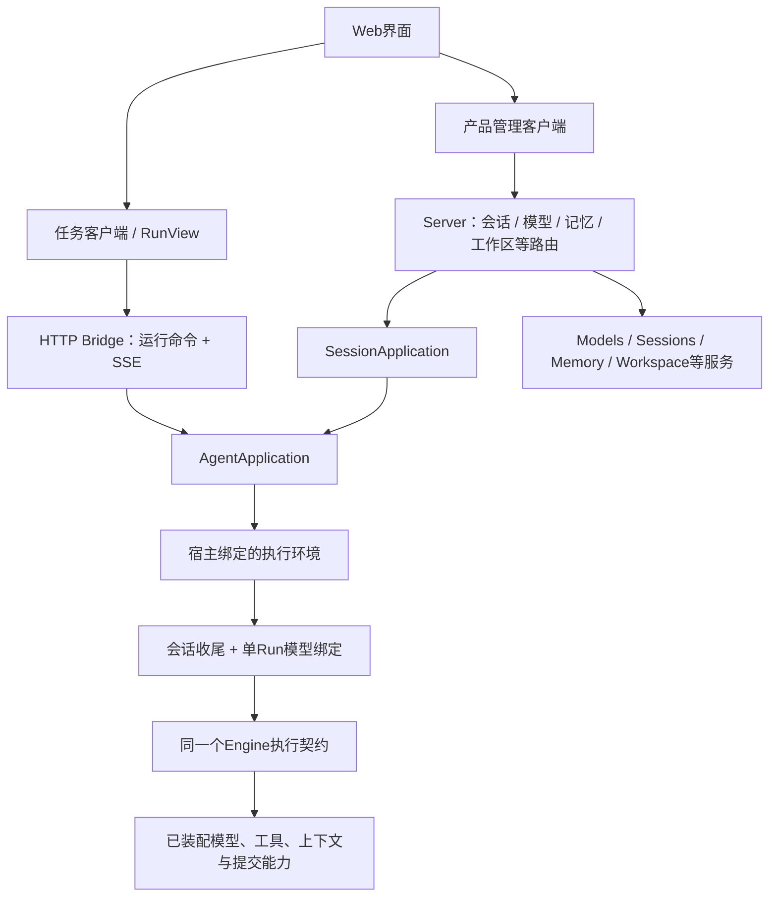
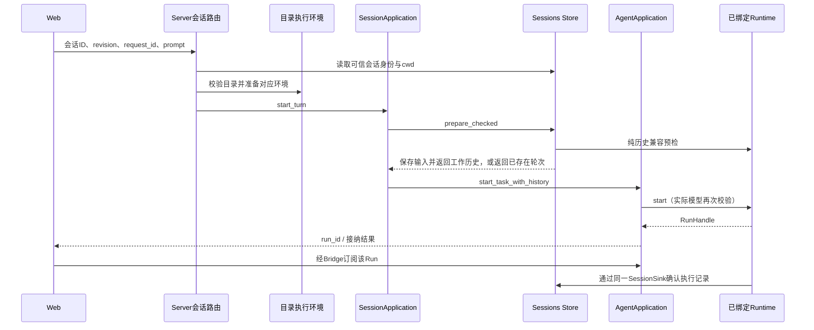

# 产品层与 Web 装配

[文档首页](../README.zh-CN.md) · [总体架构](OVERVIEW.zh-CN.md) · [核心执行](RUNTIME.zh-CN.md)

本文面向替换前端、改造 Server、接入桌面或复用产品接口的开发者。它说明已有模块的调用关系、权限和生命周期，不逐一列出界面按钮，也不将产品层能力当成 Core 的强制依赖。

## 1. 产品层不是另一个执行器

| 部分 | 职责 | 不应承担 |
|---|---|---|
| `application` | 通过 `AgentRuntime` 管理启动、取消、输入幂等、结果、订阅、回放和保留策略 | 供应商协议、具体工具、文件会话存储实现 |
| `http-bridge` | 将统一任务接口映射到 HTTP JSON 与 SSE | 构造 Engine、绑定监听端口、实现产品管理数据库 |
| `tauri-bridge` | 将同一任务接口映射到 Tauri Command/Channel，并管理 IPC ACK | 强制启动 HTTP 或自动补齐所有 Web 管理接口 |
| `client` | 框架无关的协议客户端、SSE/IPC 消费与 `RunView` 归并 | UI 组件、模型调用、工具调度或持久会话 |
| `apps/server` | 组合扩展，决定目录、权限域、配置、端口及产品路由 | 复制扩展实现，或把页面操作写进 Runtime |
| `apps/web` | 连接状态、交互、展示与产品管理客户端 | 可信权限判定、直接保存模型密钥或执行底层循环 |

当前主界面使用原生 JavaScript 模块、HTML 和 CSS，Client 不要求 React/Vue。局部文档预览有自己的隔离宿主和按需资源，不改变 Agent 执行和通用 Client 的技术边界。

## 2. 两条调用路径

通用 `/v1/runs` 是临时运行入口；持久聊天由 Server 的会话接口接纳，再进入相同的 Application 与 Runtime。不能把通用启动接口的 `request_id` 当成持久聊天身份。

模型设置和记忆管理不注册成拥有管理权限的模型工具。页面通过受鉴权的管理 API 配置扩展；模型只获得宿主明确注册并授权的运行工具。

## 3. Server 启动和配置生效

组合根先读取能力策略和工作区设置，打开 Sessions，再创建环境工厂。工厂持有模型管理/固定模型、Compactor、Spill、Memory 和历史检索等启用的能力。每个实际工作目录在需要时构造并复用执行环境，不修改进程全局 cwd。

| 配置对象 | 谁决定 | 生效边界 |
|---|---|---|
| 能力是否编译 | Cargo features | 没编译的能力不能靠页面开关产生 |
| 组件/工具是否启用、能否由用户修改 | 部署策略 + 允许的用户选择 | Host 重建/重启时装配，不更改活动注册表 |
| 模型、协议、端点、凭据与能力 | Models 管理或固定模型宿主配置 | 每个 Run 启动时绑定；后续设置变化不改变已运行任务 |
| 普通会话默认目录根 | 工作区设置 | 只影响新会话；已保存 cwd 不随切换而迁移 |
| Memory 条目 | 已授权后端 | 后续模型请求构造时刷新，不等待永久冻结的会话快照 |
| UI 展开、布局等偏好 | 页面 | 不改变任务身份、工具权限或执行目录 |

`models` 路由 Plugin 与 `manager.runtime(...)` 应配套；直接注入固定 Model 时不再同时注册同名模型服务。空模型设置是有效的首次启动状态，不意味着允许无配置自动切换假模型。

本地开发入口 `npm run dev:web` 启动真实 Rust Server 与正式 Web，使用开发启动器生成或读取的宿主凭据；不要求 `.env`。显式离线演示与真实调用是不同入口，失败不得自动降级成演示模型。

## 4. 持久会话的一轮输入

图中为新轮次成功路径。重复的已保存请求直接返回已有身份，不再次启动。revision 冲突、历史不兼容或容量不足在相应边界明确失败；预检之后发生模型配置竞态时，实际启动仍会拦截，不向错误模型发送私有历史。

会话接纳不因 HTTP 调用者断开而丢失所有权。客户端结果未知时应使用同一逻辑 request_id 查询或重发，不能另造 ID 假装是同一次操作。

会话的磁盘寿命与 Application 内存 Run 注册表不同：内存记录 TTL 到期不删除会话；删除已结束会话也不删除其工作目录中的用户文件。重启恢复已确认历史并标记中断，不自动继续外部副作用。

## 5. 通用调用面与可信调用面

| 调用面 | 典型操作 | 可接受的数据 |
|---|---|---|
| 通用任务接口 | start、cancel、input、snapshot、result、events、forget | request_id、文本、run_id、游标等受限字段 |
| 可信 Rust 宿主 | `start_task_with_history`、`wait_report` | 经宿主验证的历史/metadata；完整报告可能含私有信息 |
| 产品管理接口 | 会话、模型配置、能力、记忆、工作区 | 对应管理契约；由当前认证和管理权限约束 |

通用任务请求不能覆盖系统提示词、工具集合、运行预算、凭据或任意目录。**这不等于管理页面不能配置模型**：模型管理 API 属于另一条可信产品管理路径，不能向它照搬“普通运行用户”的默认授权。

当前 Web Server 是单一可信宿主权限域，使用 Bearer 保护任务和管理接口。公网或多用户产品需要区分管理员、普通用户及各自数据范围；仅添加一个 prompt 中的 user_id 或项目目录并不会建立租户隔离。

## 6. 事件、回放和页面归并

核心发出 `EventEnvelope`，Application 投影为 `StreamFrame`，包含 event、snapshot 或 fault。HTTP 通过 SSE 传递；Tauri 外层再附 subscription_id 和 delivery_id，用于 Channel 的确认。

| 标识 | 用途 | 不能用于 |
|---|---|---|
| `run_id` | 运行身份 | 直接证明用户有访问权 |
| `seq` / `after` | 已消费的 Run 事件游标 | 持久会话版本或工具幂等键 |
| 会话 `revision` | 防止更新覆盖较新持久状态 | SSE 重连位置 |
| 检查点 `revision` | 一次 Run 的确认顺序 | UI 动画进度 |
| Tauri `delivery_id` | 单次 IPC 包 ACK | 替代模型调用编号或 Run seq |

`RunView` 按顺序接纳更新；完成项覆盖已有项，不再把最终全文追加到之前的 token 后面。收到恢复 snapshot 时替换旧投影。过旧游标、源事件缺口或慢消费可能丢失中间动画，不能继续拼接一段不完整字符串当作完整结果。

Application 的 journal 是有界内存回放，不是磁盘事件日志。原始 Runtime 订阅只观察未来事件；需要恢复时由快照/应用回放处理。HTTP Client 使用带鉴权头的 fetch 消费 SSE，不把 Token 放到 URL。

关闭订阅、页面断线、Tauri ACK 超时不等于取消任务；停止按钮使用明确的取消操作。看到文本或工具完成也不等于 Run 成功，界面最终以 RunOutcome 为准。

## 7. 展示数据与私有数据分离

公开任务结果使用 `RunOutcome` 和有界 `RunSnapshot`，不直接序列化完整 `RunReport`、RequestAudit 或 RunCheckpoint。

`UiToolResult` 是独立的展示投影，当前可含有限文本、受限内嵌图片与资源描述；并非仅有文本占位符。远程图片地址、隐藏推理、ProviderData 和任意 structured 数据不默认透传。普通工具文本仍可能敏感，UI 转义不是内容脱敏。

页面渲染、文件预览与工具执行是三条不同路径。用户查看文件、运行交互终端或查看 Git diff 是产品层操作，不应伪造一条 Agent 工具事件。工具参数增量、预览 HTML 或历史原文都不是浏览器可以执行的程序指令。

Office/HTML 等预览必须在其受限预览宿主中处理；文档内容不获得主页面的 Bearer、会话对象或模型配置。更换渲染库时应保持这个隔离边界，而不是直接把模型输出写入主页面。

## 8. 工作目录、项目与旁支

普通 Web 会话由宿主在默认根下分配稳定目录，项目会话绑定登记目录；项目是可选组织能力，不是执行前必须创建的隐藏对象。活动 Run 持有启动时的执行环境，切换会话、项目或标签不会改变它的 cwd 和工具配置。

当前临时侧边对话复用 Application/Runtime，接收宿主恢复的父会话上下文，自己维护后续临时历史；不是持久会话树。它可以继承父会话的历史读取范围，但不取得向父轮次提交记录的身份。关闭或重启不表示存在自动恢复旁支的能力。

工作目录限定访问、Memory 空间、项目历史权限和终端进程权限分别处理。两项目共享同一个目录，不表示会话历史自动互通；同目录并发执行也不是文件事务或操作系统沙箱。

## 9. 更换前端或接入 Tauri

替换前端时保留 Client/RunView 的协议语义，将渲染映射到自己的组件。管理 API 的客户端独立于通用任务 Client；新界面不应通过暴露完整 RunReport 省略这层边界。

Tauri 宿主可以把同一个 Application 注入 Command/Channel Bridge，不必同时开启 HTTP。IPC 层处理可信窗口、capability 和逐包 ACK；模型、工具、预算与会话仍复用扩展。Web 的会话和管理路由不会因为引入 Tauri Bridge 就自动变成本机命令，需要桌面组合根明确接入。

Application 的关闭和 Host 的关闭也应分开：先停止接入、取消并等待任务，再关闭 Host/扩展和独立产品资源。临时终端和文件预览资源由其产品宿主管理，不依赖模型最终回复触发回收。

## 10. 二次开发入口

| 需求 | 首选入口 |
|---|---|
| 只换 UI 框架 | `packages/client` 的适配器与 RunView，`apps/web` 的功能模块 |
| 增加产品管理页面 | 对应 Server 管理路由 + 独立页面客户端；能力实现留扩展 |
| 调整默认装配 | Server Cargo features、`capabilities`、`environment` |
| 更换会话/记忆位置和权限域 | 宿主存储装配，不修改 Runtime 默认历史 |
| 接入多用户认证 | 产品路由、权限域与管理授权，不从模型参数推断身份 |
| 增加后台编排 | 独立扩展与受控任务入口，不让页面组件拥有执行循环 |

## 源码定位

| 关注点 | 源码 |
|---|---|
| 产品启动与环境装配 | [`server/main.rs`](../../apps/server/src/main.rs)、[`environment.rs`](../../apps/server/src/environment.rs)、[`capabilities.rs`](../../apps/server/src/capabilities.rs) |
| 统一调用与会话适配 | [`application/service.rs`](../../packages/application/src/service.rs)、[`sessions.rs`](../../packages/application/src/sessions.rs)、[`protocol.rs`](../../packages/application/src/protocol.rs) |
| 传输 | [`http-bridge/src`](../../packages/http-bridge/src)、[`tauri-bridge/src`](../../packages/tauri-bridge/src) |
| Client 与页面组合 | [`client/src`](../../packages/client/src)、[`web/app.mjs`](../../apps/web/app.mjs) |
| 产品会话与记忆授权 | [`session_routes`](../../apps/server/src/session_routes)、[`memory_routes.rs`](../../apps/server/src/memory_routes.rs) |
| 工作目录与临时旁支 | [`workspace_setup.rs`](../../apps/server/src/workspace_setup.rs)、[`side_routes.rs`](../../apps/server/src/side_routes.rs) |
| 受限文件预览 | [`web/file-preview.mjs`](../../apps/web/file-preview.mjs)、[`document-preview.js`](../../apps/web/document-preview.js) |
